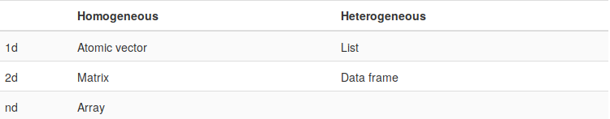
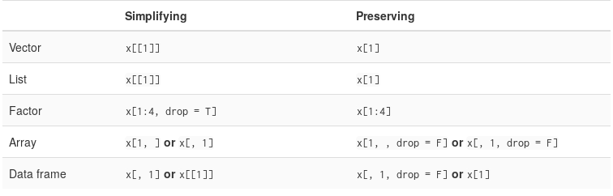

```{r setup, include=FALSE}
knitr::opts_chunk$set(echo = TRUE, error = TRUE)
```


R es un software especializado en análisis estadístico con gran presencia en el
mundo académico y en el mundo laboral. La flexibilidad que se tiene con él para
manipular datos ha logrado posicionarlo dentro de las herramientas más completas
que se tienen para obtener *insight* de un conjunto de datos. Adicionalmente,
gracias a que es *software libre*, contribuyentes de todo el mundo han logrado
acumular una gran cantidad de bibliotecas con funciones especializadas para
resolver todo tipo de problemas que se presenten en el proceso de análisis de
datos.


# Nociones básicas de R.

Una de las funciones que más se encontrarán utilizando en R es **library**, que
utilizamos para cargar una biblioteca y tener al alcance en cada sesión las
funciones que necesitaremos para el problema que queramos resolver.

```{r}
suppressMessages(library(tidyverse))
```

Para definir un directorio de trabajo, usamos la función "setwd"
```{r}
setwd("/home/luis/Desktop/Ayudantia_CienciaDeDatosMdoCapitales/Clase_15-08-2018/")
```

Para obtener la ruta en la nos encontramos trabajando, usamos "getwd"

```{r}
getwd()
```


Para crear un nuevo objeto (o si lo prefieren, asignarle un nombre a un objeto) 
en R exite un operador especial "<-", que se prefiere
en lugar del clásico "=" para evitar confusiones cuando en una misma linea u
operación se estén usando ambos operadores, RStudio tiene un atajo que escribe
el operador y lo rodea con espacios, "Alt + -", (tecla Alt y tecla guión) para
evitar presionar ambas teclas ("<"" y "-"") cada que se asigne un nombre a un
nuevo objeto, y que nos ayuda a conservar las conveciones que se siguen en R
para tener un código legible y ordenado.

```{r, include=TRUE, echo=T, results=T}
x <- 10

print(x)
```


# Estructuras de datos en R
R tiene cuatro tipos de estructuras de datos principales, que se diferencian
pricipalmente en su dimensión y en la variedad de tipos datos que pueden
almacenar.

La siguiente table la tomamos de [@AdvancedR2015]

```{r pressure, echo=FALSE, fig.cap="Estructuras de datos en R", out.width = '100%'}

```

## Coerción de datos.
Para entender mejor el funcionamiento de las estructuras de datos en R, es
necesario conocer las reglas de coerción que tiene el lenguaje para mantener
consistencia. La coerción de datos se refiere a la conversición del tipo de
datos que hacen los lenguajes de programación para mantener consistencia en un
programa. En R, tenemos cuatro tipos principales de datos que podemos almacenar
en alguna de las estructuras de datos que R soporta: lógicos, enteros, dobles y
caracteres (texto).

Como veremos más adelante, dado que existen estructuras homogéneas de datos,
R se vale de un conjunto de reglas de coerción para evitar incosistencias en
un programa; dichas reglas están basadas en una jerarquía de flexibilidad de los
tipos de datos que tenemos para convertirlos a algún tipo diferente. Del menos
al más flexible, la lista es:

* booleano
* entero
* doble
* caracter

Así, al momento de crear un objeto homogéneo en el que haya mezclados diferentes
tipos de datos, R convertirá de acuerdo a lo anterior, por ejemplo:
```{r}
x <- c(TRUE, FALSE, 5, 10)
print(str(x))
```
Vemos que los valores lógicos fueron coercionados a enteros, específicamente,
TRUE se convierte a 1 y FALSE a 0. Otro ejemplo:
```{r}
y <- c(5, 9.999, FALSE)
```
```{r}
str(y)
```

```{r}
y[2]
```
```{r}
y
```
Vemos que, a pesar imprimir el valor del doble redondeado, el valor almacenado
en memoria sí es el valor que asignamos directamente al objeto.
Finalmente, sin importar qué intentemos guardar en un vector, si hay una entrada
que sea texto, todo el vector será convertido a texto, dado que es el tipo de
dato más flexible.
```{r}
a <- c(TRUE, FALSE, 5, 6, 9.999, "Texto")
```
```{r}
str(a)
```

Vale la pena notar que los valores lógicos no fueron convertidos a entero antes
de ser convertidos a texto, por lo que en el vector se almacena la cadena tal
cual la escribimos. Casi distinto es si hacemos lo siguiente:
```{r}
a <- c(F, T, 9.999, 10)
```
```{r}
str(a)
```


```{r}
a <- c(a, "Falso")
```
```{r}
str(a)
```

En el caso anterior, dado que los valores lógicos primero fueron transformado a
entero, se almacena el valor entero como cadena de texto, "1" y "0".


## Vector atómico.
Un vector es la estructura más simple en R, es unidimensional y puede almacenar
objetos de un sólo tipo de dato, es decir, no puedes tener en un vector una
entrada numérica y otra booleana. Para crear un vector, utilizamos la función
c().
```{r}
vector_1 <- c(1:90)
```
```{r}
str(vector_1)
```

La función str() nos imprime un resumen con las características principales
de un objeto. En el caso anterior, vemos que "vector1" es un objeto con entradas
enteras (int), de dimensión 1x90 ([1:90]), e imprime las primeras diez entradas
del mismo. Los vectores siempre conservan su dimensión, no importa si los
anidamos:
```{r}
vector_2 <- c(1, 2, c(3, 4, c(5, 6)))
```
```{r}
str(vector_2)
```

## Lista
La lista es la siguiente estructura de datos en términos de dimensión,
la diferencia primordial es que una lista es heterogénea, es decir, en sus
entradas puede almacenar cualquier tipo de datos, e incluso de otras estructuras
de datos. Las listas son recursivas, lo que quiere decir que una lista puede
almacenar listas que estén dentro de otras listas. Creamos una lista con la
función list()
```{r}
lista_1 <- list(1:10, letters[1:10], lm(Sepal.Length ~ Sepal.Width, data = iris))
```
```{r}
str(lista_1)
```

```{r}
length(lista_1)
```
Vemos que la lista que acabamos de crear es de tamaño (dimensión) 3, y que su
tercer entrada es el resultado de un ajuste de un modelo lineal sobre el famoso
conjunto de datos "iris", que es a su vez una lista. Más adelante veremos los
fundamentos de la *programación funcional*, en la que las listas toman un papel
importante.

### Atributos en vectores y listas.
R permite agregar metadatos a los objetos que creamos, esto con la finalidad de
tener más y mejores formas de trabajar con ellos, pues nos permiten crear
referencias a los objetos dentro de dichas estructuras a partir de esos metadatos.
Uno de los atributos más utilizados es el nombre. Como veremos adelante,
cuando estamos recuperando información específica dentro de una estructura,
referenciarla directamente con su nombre facilita la recuperación de la misma.
Podemos agregar nombres a las entradas de un vector desde su creación:
```{r}
vector_con_nombres_1 <- c(a = 1, b = 2, c = 3)
```
```{r}
str(vector_con_nombres_1)
```

O podemos agregar un nombre después de crear el vector:
```{r}
vector_con_nombres_2 <- c(1, 2, 3)
```
```{r}
str(vector_con_nombres_2)
```

```{r}
attr(x = vector_con_nombres_2, "Name") <- c("a", "b", "c")
```
```{r}
str(vector_con_nombres_2)
```

O de manera más directa, con la función names()
```{r}
vector_con_nombres_3 <- c(1, 2, 3)

```
```{r}
str(vector_con_nombres_3)
```

```{r}
names(vector_con_nombres_3) <- c("a", "b", "c")
```
```{r}
str(vector_con_nombres_3)
```

Podemos hacer lo mismo con una lista:
```{r}
lista_con_nombres <- list(VecNum = 1:5, VecLet = letters[1:27],
                          LinMod = lm(Sepal.Length ~ Sepal.Width, iris))
```
```{r}
str(lista_con_nombres)
```

Después de crear la lista:
```{r}
lista_con_nombres_2 <- list(1:5, letters[1:27], lm(Sepal.Length ~ Sepal.Width,
                                                   iris))
names(lista_con_nombres_2) <- c("VecNum", "VecLet", "LinMod")
```
```{r}
str(lista_con_nombres_2)
```

Importante: los atributos de los objetos son guardados en una lista, por lo que
un mismo objeto puede tener multiples atributos.
```{r}
str(attributes(lista_con_nombres_2))
```
```{r}
attr(lista_con_nombres_2, "Posicion") <- c(1, 2, 3)
```
```{r}
str(attributes(lista_con_nombres_2))
```

Algunas de las funciones que son de gran utilidad para la manipulación de los
vectores y las listas son length(), que nos devuelve el tamaño (longitud),
names(), que nos devuelve los nombres de las entradas de los objetos, si es que
lo tienen.
```{r}
names(lista_con_nombres)
```
```{r}
names(vector_con_nombres_1)
```
```{r}
print(length(lista_con_nombres_2))
```
```{r}
print( length(vector_con_nombres_3))
```
Podemos combinar vectores y listas con la función c():
```{r}
vector_combinado <- c(vector_con_nombres_1, vector_con_nombres_2)
```
```{r}
vector_combinado
```

Vemos que los nombres deben ser únicos, por lo que los nombres del segundo
vector son ignorados.

Para las listas:
```{r}
lista_combinada <- c(lista_con_nombres, lista_con_nombres_2)
```
```{r}
str(lista_combinada)
```

En la lista, vemos que los nombres sí se repiten, y tenemos 6 entradas de la
lista, sin embargo, no es la mejor de las prácticas tener dos o más objetos
con el mismo nombre dentro de una lista, pues esto puede generar resultados
inesperados.


## Matrices y Arreglos
Las matrices son arreglos de dos dimensiones, utilizados para la mayoria de las
funciones de uso estadístico (la especialidad de R). Como se ve en la imagen
inicial, las matrices son una estructura de datos homogénea, es decir, no es
posible definir una matriz cuyas entradas sean de distintos tipos de datos.
Existen tres maneras de definir una matriz: función matrix(), función array() y
dándo dimensión a un vector atómico con la función dim()
```{r}
matriz_1 <- matrix(1:9, nrow = 3, ncol = 3)
```
```{r}
matriz_1
```

Si queremos que los número se acomoden en la matriz siguiendo las columnas y no
los renglones, usamos un argumento más de la función matrix:
```{r}
matriz_2 <- matrix(1:9, ncol = 3, byrow = T)
```
```{r}
matriz_2
```

Dando dimensión a un vector:
```{r}
matriz_vector <- c(1:9)
```
```{r}
matriz_vector
```

```{r}
dim(matriz_vector) <- c(3, 3)
```
```{r, }
matriz_vector
```


Utilizando la función array:
```{r}
matriz_array <- array(1:9, c(3, 3, 1))
matriz_array
```
En el ejemplo anterior, vemos que las dimensiones del arreglo que queremos
crear se especifican dentro de un vector que sirve como parámetro de la función
array(). Podemos crear matrices con la función array(), pues las matrices son un
caso especial de una estructura de n dimensiones. Los arreglons multidimensionales
son poco utilizados en R, sin embargo, no está de más conocerlos.
```{r}
arreglo_1 <- array(1:12, c(2, 3, 2))
arreglo_1
```
Igual que con las listas y los vectores, es posible asignar atributos a las
matrices y los arreglos. Las funciones de tamaño y nombres de los objetos
anteriores se generalizan para tomar en cuenta las dos dimensiones de las
matrices, así:
```{r}
rownames(matriz_1) <- letters[1:3]
colnames(matriz_1) <- LETTERS[1:3]
matriz_1
```
```{r}
ncol(matriz_1)
```
```{r}
nrow(matriz_1)
```
Para un arreglo:
```{r}
dim(arreglo_1)
```
```{r}
dimnames(arreglo_1) <- list(c("row1", "row2"), c("col1", "col2", "col3"),
                            c("A", "B"))
arreglo_1
```
El output de la función str() para matrices y arreglos es diferente, sin importar
si tienen las mismas dimensiones (sólo posible en el caso de un arreglo con
"tercera" dimensión 1).
```{r}
str(matriz_1)
```
```{r}
str(arreglo_1)
```
Finalmente, podemos combinar matrices con las funciones rbind() y cbind(),
dependiendo de la manera que queramos hacerlo:
```{r}
matriz_combinada_col <- cbind(matriz_1, matriz_2)
matriz_combinada_col
```
```{r}
matriz_combinada_ren <- rbind(matriz_1, matriz_2)
matriz_combinada_ren
```
De nuevo, los nombres repetidos son ignorados.


## Data Frames
Los Data Frames son arreglos heterogéneos de dos dimensiones, es decir, pueden
contener multiples tipos de datos, **siempre y cuando** las columnas del data
frame sean homogéneas cada una. Los data frames son una de las estructuras más
usadas y más flexibles al momento de hacer análisis de datos. Un data frame
es en realidad una lista formada de vectores de la misma dimensión, de ahí
que las columnas de cada data frame son homogéneas. Para crear un data frame,
utilizamos la función data.frame(), a la que es necesario pasar como argumentos
vectores con nombres, que servirán como nombres de las columnas del data frame.
```{r}
dataframe_1 <- data.frame(a = 1:3, b = letters[1:3])
dataframe_1
```
Vemos que la columna b es convertida automáticamente a factor, lo que puede
ocasionar muchos problemas al momento de automatizar una tarea, por lo que es
mejor evitar dicho comportamiento (muchas de las opciones de carga de datos en R
tienen argumentos extra para evitarlo), y sólo convertir a factores cuando sea
necesario/deseado.
```{r}
dataframe_2 <- data.frame(a = 1:3, b = letters[1:3], stringsAsFactors = F)
dataframe_2
```

Podemos combinar data frames con las mismas funciones, cbind() y rbind(). Sin
embargo, hay que tener en cuenta que el resultado de dichas funciones sólo será
un data frame si los argumentos que le pasamos son ya data frames; si usamos
la función cbind() con dos vectores, nos devolverá una matriz en su lugar.

# Operador "<-" vs "="
Hay sútiles diferencias entre los dos operadores que pueden ocasionar problemas
en nuestro código, por lo que es importante conocer qué los hace diferentes.
El ejemplo más claro es el "alcance" (*scope*) de cada uno, por ejemplo:
```{r}
# Borramos x si existe
rm(x)

```


```{r}
mean(x = 1:10)
```
```{r}
x
```

Vemos que el operador "=" sólo funciona dentro del scope de la función, pero
no tiene ningún efecto en el ambiente globlal de nuestra sesión.

Ahora, intentamos lo mismo con el operador "<-"

```{r}
rm(x)

mean(x <- 1:10)
```
```{r}
x
```
```{r}
y <- mean(x)
```
```{r}
y
```


Por lo anterior, es recomendable siempre utilizar el operador "<-" para asignar
un nombre a un objeto, pues al utilizarlo dentro de la llamada de una función
corremos el riesgo de sobreescribir el valor de una variable en el ambiente
global de la sesión, y si hay algún otro proceso dentro de nuetro código que
depende del msimo objeto, podemos terminar con resultados muy distintos a los
esperados.

# Convenciones para escribir código
Cada quien tiene su estilo para escribir código, sin embargo, existen muchas
convenciones que se utilizan primordialmente para facilitar la lectura del
código que produzcamos. Esto se agredece bastante cuando el código se comparte
y lo utilizan muchas personas, por ejemplo, en un grupo de trabajo.

## Nombrar objetos
Una de las prácticas principales es hacer que los nombres de nuestros objetos
sean lo más explicitos posibles, y sigan siempre un mismo patrón de nombramiento,
con lo cual le estaremos haciendo la vida mucho más fácil a nuestros colaboradores.
Las tres principales que se sugieren en [@r4ds2017] son:

### Camel case
Combinación de letras mayúculas y minúsculas, siempre empezando con minúscula,
y si es necesario un número. Por ejemplo:

* variableParaIterar1
* coeficienteRegresionB1

### Snake case
La convención snake case nos dice que separemos las palabras que formas el
nombre de nuestro objeto con guiones bajos.

* variable_para_iterar_1
* coeficiente_regresion_B1

### Puntos
Similar al caso anterior, pero utilizando un punto en lugar de un guión bajo:

* variable.para.iterar.1
* coeficiente.regresion.B1

## Indentado
Actualmente, la gran mayoria de los IDEs y de los editores de texto tienen
implementando el indentado automático de nuestro código. El indentado resulta
bastante útil visualmente cuando tenemos un código sumamente complejo, nos ayuda
a localizar rápidamente la falta de algún paréntesis o llave de apertura o cierre,
localizar parámetros de funciones dentro de una llamada a una función demasiados
de ellos, etc.

```{r}
# Es fácil anidas un ciclo for, pues el indentado lo hace automáticamente
# RStudio

# Código indentado
for (i in 1:length(seq(5))) {
  cat("Iteración ", i, " de ", length(seq(5)), " nivel 1.", "\n")
  
  for (j in 1:length(seq(5))) {
    cat("\tIteración ", j, " de ", length(seq(5)), " nivel 2.", "\n")
  }
  
}

# Código sin indentar
for (i in 1:length(seq(5))) {
cat("Iteración ", i, " de ", length(seq(5)), " nivel 1.", "\n")
for (j in 1:length(seq(5))) {
cat("\tIteración ", j, " de ", length(seq(5)), " nivel 2.", "\n")
}
}

```


# Subsetting
Hay tres operadores para obtener subconjuntos de datos de nuestros objetos:

* [
* [[
* $

Los tres operadores funcionan de manera diferente para cada estrucutra de las ya
definidas. La principal diferencia es la forma en la que regresan los datos,
además de la manera en la que los utilizamos, y del tipo de datos con el que
los utilizamos.

## Vector
Con un vector, sólo funciona el primer operador, [, y su comportamiento depende
del tipo de dato que utilicemos para realizar el subsetting. Tenemos los
siguientes casos:

### Enteros positivos
Al pasar valores enteros al operador, éste los interpreta como posiciones, por
lo que devolvera los objetos que se encuentren en las posiciones del valor
que usamos dentro de los corchetes. Recordemos que, a diferencia de otros
lenguajes, en R el índice dentro de una estructura inicia en 1, no en 0. Así:
```{r}
vector_subsetting <- c(1:90)
vector_subsetting[56]
```
Si pasamos un vector, devuelve todos los objetos en las posiciones especificadas
```{r}
vector_subsetting[c(1, 50, 89)]
```
Pasar valores duplicados, duplica el valor devuelto:
```{r}
vector_subsetting[c(1, 1, 2, 2)]
```
### Enteros negativos
El operador interpreta también como posiciones los enteros negativos, sin embargo,
devuelve el vector original **sin** las entradas especificadas en el vector/número
negativo que se le pase:
```{r}
vector_subsetting[-c(1:85)]
```
No es posile mezclar enteros positivos y negativos:
```{r}
vector_subsetting[c(1, -2)]
```

### Valores lógicos
Los valores lógicos son quizá los más útiles en combinación con los operadores
para obtener subconjuntos de nuestros datos. Al pasar un vector de valores
lógicos, obtendremos un subvector con los objetos en las posiciones donde el
vector lógico es TRUE.
```{r}
vector_subsetting_2 <- c(1:6)
vector_subsetting_2[c(T, F, T, F, T, F)]
```
Si el vector lógico que se pasa al operador es de menor longitud, se recicla,
es decir, se repite hasta igualar la longitud del vector sobre el que se está
haciendo la operación.
```{r}
vector_subsetting_2[c(T, F)]
```
Como mencionamos, resultan de gran utilidad para obtener subconjutos de nuestras
estructuras que cumplen cierto criterio, por ejemplo:
```{r}
# Creamos un vector lógico:
vec_log <- vector_subsetting %% 2 == 0 # %% es la función modulo
```
```{r}
vec_log
```

```{r}
# Lo usamos para obtener un subconjuto de los números pares del vector_subsetting
vector_subsetting[vec_log]
```
Si el vector tiene nombres, podemos usarlos para obtener subconjuntos:
```{r}
vector_con_nombres_1["b"]
```
```{r}
vector_con_nombres_1[c("a", "b")]
```

## Lista
En una lista se aplican los operadores de la misma forma en la que se aplican
con un vector atómico. Sin embargo, en una lista sí es posible utilizar los
otros dos operadores, $ y [[. Cada uno tiene un comportamiento diferente en la
lista.

[ siempre devolvera una lista:
```{r}
str(lista_con_nombres[1])
```
[[ y $ devuelven el objeto mismo en la posición o con el nombre que se use con el
operador:
```{r}
str(lista_con_nombres[[1]])
```
```{r}
lista_con_nombres$VecNum
```

## Matrices y Data Frames
En las matrices y data frames, podemos utilizar un sólo vector, dos vectores,
uno para cada dimensión, o incluso sacar provecho de los nombres, si los hay.
```{r}
matriz_1
```
```{r}
matriz_1[1, 3]
```
```{r}
matriz_1[c(1, 2), c("A", "C")]
```
```{r}
matriz_1[c(F, T, F), c(F, F, T)]
```
En los data frames se pueden obtener subconjuntos de la misma forma, pero se
obtiene más provecho con los otros dos operadores.
```{r}
head(iris)
```
```{r}
iris$Sepal.Length
```
```{r}
iris[1]
```
```{r}
iris[[1]]
```

Como vemos, los resultados de dos de los operadores difieren del otro.

## Subsetting con preservación y sin preservación
Los resultados de los tres operadores devuelven los datos en formas/estructuras
distintas, por lo que se definen dos tipos de subsetting: con preservación y
sin preservación. Como su nombre lo dice, el subsetting con preservación devuelve
un objeto con las mismas características del objeto sobre el que se aplica el
operador con preservación, mientras que el subsetting sin preservación devuelve
un objeto con características distintos al objeto originial. La siguiente tabla
también sale de [@AdvancedR2015]:
```{r subsetTypes, echo=FALSE, fig.cap="Características de los operadores de subsetting", out.width = '100%'}

```
Así, veamos las diferencias:
```{r}
str(lista_con_nombres_2[1])
```
```{r}
str(lista_con_nombres_2[[1]])
```

En un data frame:
```{r}
str(iris[1])
```
```{r}
str(iris[[1]])
```
```{r}
str(iris$Sepal.Length)
```
Es importante tener en cuenta lo anterior cuando queramos hacer operaciones
con objetos que extraigamos de algun otra estrucutra, pues podemos terminar
con resultados inesperados o tener un error de ejecución.

# Estructuras de control
Al igual que en el resto de los lenguajes de programación, en R podemos
construir estructuras de control que nos ayudarán a repetir instrucciones
o a controlar en qué momento queremos detener la ejecución de nuestras
funciones, etc.

## For
```{r}
for(i in 1:10) {
  print(i)
}
```

# If
```{r}
int <- 15
for (i in 1:20) {
  if (i == int) {
    cat("Esta iteración es especial\n")
  } else {
    cat("Iteracion ", i, " de 100\n")
  }
}
```

# While
```{r}
int <- 15
cont <- 1
while(cont <= int) {
  if (cont == int) {
    cat("Llegamos al valor deseado")
    break
  } else {
    cat("El control es ", cont, "\n")
    cont <- cont + 1
  }
}
```
Vemos que dentro del if en el ejemplo anterior tenemos la función "break", en
un ciclo while es importante tener una forma de detener un ciclo, de lo
contrario se ejecutará de manera indefinidad y hará que nuestro programa
falle.


# Una probada del tidyverse: *dplyr*
El paquete *dplyr* presenta un nuevo paradigma de manipulacíón de datos en R,
basándose en 5 verbos (funciones) que, al combinarlos con un gran número de
funciones auxiliares nos brindan un framework sumamente flexible. Dichos
verbos son: select, filter, mutate, arrange y summarize.
Al combinar la flexibilidad de dplyr con otros paquetes presentes en el
tidyverse (ver [@r4ds2017] para más detalle del tidyverse), obtenemos un
conjunto de herramientas que convierten a R en una herramienta de gran poder
para el análisis de datos.

## Select
La función select nos ayuda a obtener un subconjuno de nuestros datos que
contenga sólo las columnas que seleccionamos con la función (o sin ellas,
si las precedemos por un guión).

Usando el data frame *iris* para ejemplificar:
```{r}
head(iris)
```
```{r}
iris %>% select(Sepal.Length, Sepal.Width, Species)
```
```{r}
iris %>% select(-Petal.Length, -Petal.Width)
```

## filter
La función filter nos ayuda a seleccionar un conjunto de renglones de un
data frame, que cumplan algún criterio de interés.
```{r}
iris %>% filter((Species == "setosa") & (Sepal.Length > 5))
```
```{r}
iris %>% filter((Species == "versicolor"))
```

## mutate
Con la función mutate somos capaces de crear nuevas columnas en un data frame
a partir de los valores de otras columnas existentes en el mismo,
**para cada renglón/observación**.

```{r}
iris %>% mutate(Area = as.numeric(Sepal.Length)*as.numeric(Sepal.Width))
```

## arrange
Con arrange, podemos ordenar las observaciones de un data frame de acuerdo a los
valores de una o más columnas, sin importar si son de distintos tipos de datos.
```{r}
iris$Species <- as.character(iris$Species)
```

```{r}
iris %>% arrange(desc(Species), Sepal.Length)
```

## summarize
La función summarize nos ayuda a obtener valores estadísticos de las columnas
que forman un data frame. Por ejemplo, queremos los valores promedio de las
cuatro columnas de iris por cada especie.
```{r}
iris %>% group_by(Species) %>% summarise(PromSepal.Length = mean(Sepal.Length),
                                         PromSepal.Width = mean(Sepal.Width),
                                         PromPetal.Length = mean(Petal.Length),
                                         PromPetal.Width = mean(Petal.Width))
```


# Referencias