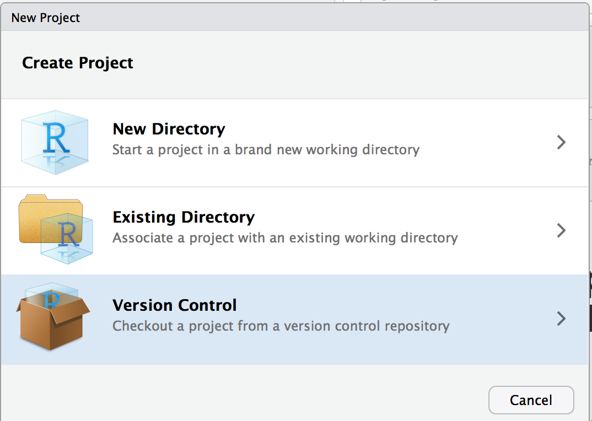
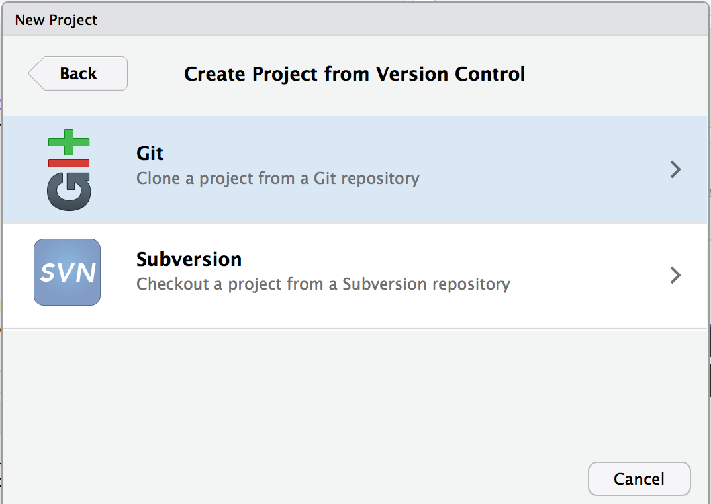
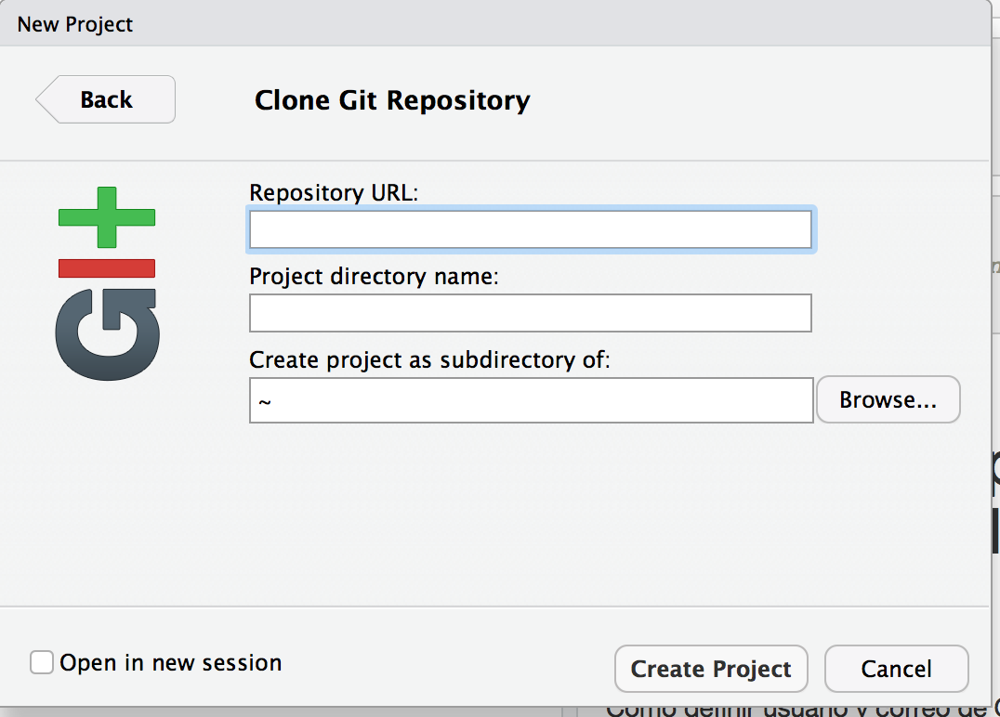

```{r setup, include=FALSE}
knitr::opts_chunk$set(echo = TRUE, error = TRUE)
```


# ¿ Para qué se necesita Github?

Cuando empezamos a resolver un problema en Ciencia de Datos.. ¿Qué sucede con los primeros pasos de transformación y análisis exploratorio? Se trata de un proceso iterativo. Normalmente, analizamos por primera vez los datos, nos damos cuenta que nos falta información (o surgen nuevas ideas que requieren de otra información) y vamos a conseguirla.. Una vez que contamos con esta nueva información, se une con la original (como explicamos en la clase de relaciones, llaves y joins) para después analizar los datos de nuevo.. En este punto, uno de los siguientes problemas que surgen es que encontramos duplicados, por lo tanto volvemos al análisis de los datos.. 


Dependiendo de la complejidad del problema y la cantidad de información, este proceso puede involucrar varios días. ¿Qué pasa si durante este proceso de evaluación nos damos cuenta que el código del día anterior era el correcto? Cada vez que agregamos información, ¿debemos borrar código (en el cual invertimos una buena cantidad de horas) o tenemos que hacer un archivo diferente por cada cambio? La respuesta es: No, para eso existe Git (o Github).

<br />
Y no solo para eso, muchas veces estamos haciendo trabajo en colaboración, como lo tendrán que hacer en los proyectos finales. ¿Qué pasa si dos personas quieren agregar código o reutilizar la misma función pero agregando un parámetro distinto? ¿Cómo sabemos que la otra persona ya agrego la parte correspondiente sin estar abriendo cada archivo y revisando todas las lineas? También Github nos ayuda con esto.

<br />

En el laboratorio de hoy vamos a ver como utilizar el servicio de Github (compatible con R studio), como una solución ideal para 3 aspectos básicos en el area de Ciencia de Datos:

* Guardar archivos en un Repositorio (a.k.a. Repo, Repository)
* Registrar los cambios hechos en los archivos 
* Revisar un proyecto de Github desde R Studio

<br />
En esta ocasión vamos a mostrar los aspectos básicos de la plataforma, con el fin de que puedan empezar a crear sus nuevos repositorios para los proyectos. Nosotros vamos a hacer las evaluaciones directamente de los repositorios e iremos tomando en cuenta sus avances semanales.

<br /> 

# Git y Github

Vamos a comenzar por entender la diferencia entre Git y Github. Por un lado, **Git** es el servicio (a.k.a. Control de versiones / Version Control / VCS) que otorga un sistema similar a una mini base de datos de los archivos para mantener un registro de los cambios. En particular, contiene información sobre un instante (a.k.a. _snapshot_), es decir, cada vez que hacemos un cambio en algún archivo y lo guardamos en nuestra computadora (mejor conocido como un cambio "Local" en Ciencias de la Computación) entonces el sistema guarda el registro de Git en el estado **Modified** (esto seria una version preliminar del archivo, por ejemplo, en lo que probamos que nuestro código funcione con distintas muestras). Si este cambio es de nuestro agrado (version final), podemos mantenerlo como una nueva version del con el estado de: **Commit**. También podemos dejar muchos archivos en version preliminar para mandarlos en conjunto con el siguiente commit, a esto se le llama **Staged**. 

<br /> 

Visto de esta forma, Git mantiene los archivos en 3 estados dentro de nuestra computadora (localmente) y para lograr esto lo único que tenemos que hacer es instalar Github en la computadora[^1] e inicializar un git-folder (comando **git init**).

<br /> 

Con el siguiente comando podemos checar que la computadora tiene Git.

```{bash}
git --version
```

<br />
Ahora, por otro lado, tenemos **Github** que consiste en la pagina web / interfaz gráfica[^2] con referencias a otros usuarios, organizaciones, acceso público y privado a nuestros repositorios y control de cambios. Aquí es precisamente donde nosotros hemos puesto la notas del curso. En particular, creamos una organización llamada "Ciencia de Datos en el Mercado de Capitales" y un repositorio llamado "Seminario_Ciencias" dentro de dicha organización. Cada repositorio puede estar localmente en sus computadoras, en la ubicación que prefieran (mis documentos, descargas, etc).

<br />
Para trabajar en Github se necesita una cuenta [gratuita o con costo mensual](http://github.com) para crear repositorios privados. **El correo debe ser el mismo que se usa para registrar Git**. Para el proyecto final tendrán que tener una cuenta Git y Github (la versión gratuita es suficiente), ya que van a crear sus propios repos por equipo dentro de la organización, y serán evaluados con base en los avances de cada integrante usando el control de cambios. Ademas, los datos que mandemos para las tareas estarán también disponibles en este servicio (Github tiene algunos limites de tamaño para transferir archivos en su modo básico pero se pueden dividir los datos en sub-archivos de 100mb = batch)

<br /> 

# 1 Guardar archivos en un Repositorio 
Para crear un nuevo repositorio y guardar nuestros archivos hay 2 vías: Repo local y Repo desde Github.


### 1.1 Repo local
Podemos inicializar repo en el folder de nuestra computadora que nos interesa meter al sistema de control de cambios:

```{bash}
### Create a new folder
mkdir InitLocal_SeminarioDS
### Start the git system
git init
### Create a new file call readme
echo "Git test" > InitLocal_SeminarioDS/README
ls InitLocal_SeminarioDS/
```

Una vez creado este repo podemos revisar el estado de nuestro sistema, donde nos va a registrar todos los archivos que se han cambiado, borrado o agregado a través de "Untracked files":

```{bash}
git status InitLocal_SeminarioDS
```

Para agregar estos cambios como una version final tenemos que hacer lo siguiente:


```{bash}
git add InitLocal_SeminarioDS/README
git commit -m "my first commit to include a README"
```

Vamos a checar nuevamente el estado y ya no aparece en la lista de elementos pendientes (untracked):

```{bash}
git status InitLocal_SeminarioDS
```

<br />

### 1.2 Repo en Github
En esta opción podemos crear el Repo a traves de Github (pagina web). Para esto, ingresamos a la pagina, vamos a nuestro usuario y a la parte de repositorios. Aquí podemos seleccionar la opción de _nuevo repositorio_ (_create new repo_), le podemos asignar un nombre e incluso las personas que van a colaborar (mandamos referencias usando los nombres de usuario de Github de los colaboradores, esto es en _settings_ una vez creado el nuevo repo).


En este punto ya se puede descargar el repo en nuestra computadora, con el comando **git clone** y se puede comenzar a agregar archivos. Lo mismo sucede no solo cuando creamos un repo, también cuando queremos obtener uno ya existente en la web. Durante el curso van a encontrar que muchas paqueterías tanto en R como en Python, así como otros proyectos a los cuales haremos referencia, están precisamente guardados como repos públicos en Github.

<br />

- Para clonar un repo al sistema local y poner el nombre que tiene en Github: 

    + *git clone git://github.com/USUARIOdeGITHUB/NOMBRErepo.git *

<br />

- Para clonar un repo al sistema local y usar de manera local (únicamente) otro nombre:

    + *git clone git://github.com/USUARIOdeGITHUB/NOMBRErepo.git NombreFolderLocal *

<br />


# 2 Registrar cambios en Git y Github
Una vez iniciado un folder con el sistema de Git y el repo creado en Github, podemos comenzar a registrar todos los cambios que hacemos:

### 2.1 Cambios enviados a Github

* Usando el folder que acabamos de crear "InitLocal_SeminarioDS" vamos a incluir un archivo de texto (file2.txt)

```{bash}
git status InitLocal_SeminarioDS
```

```{bash}
echo "git modification to commit" >  InitLocal_SeminarioDS/file2.txt
ls InitLocal_SeminarioDS/
```

```{bash}
git status InitLocal_SeminarioDS
```


* Comando para cuando estamos seguros del cambio o archivo nuevo (versión final). En este caso, una vez hecho el "commit" en Git, si queremos verlo en Github debemos correr el comando "push".

```{bash}
git add InitLocal_SeminarioDS/file2.txt
git commit -m "my second commit to push to Github"
```

```{bash}
git status InitLocal_SeminarioDS
```

```{bash}
git push
```

* Para revisar el historial (a.k.a. logs) de estos cambios hechos con commit

```{bash}
git status InitLocal_SeminarioDS
git log --decorate
```

* En caso de que nos equivoquemos existe **git reset**, en particular para olvidar archivos y cambios dentro de "stage" (si hacemos esto, vamos a ver los efectos DIRECTAMENTE en los archivos de nuestra computadora!!)

```{bash}
# This doesn’t affect the file, only the commit !!
git reset HEAD InitLocal_SeminarioDS/file2.txt
```

```{bash}
git status InitLocal_SeminarioDS
```

```{bash}
ls InitLocal_SeminarioDS
```

* Si queremos cancelar un "commit" (este proceso regresa los archivos a un paso anterior, es mas seguro y guarda la historia, a diferencia de reset)

```{bash}
# git revert commitNUMBER
```


<br />

### 2.2 Cambios pendientes
Cuando estamos trabajando con cambios pendientes, de los cuales no estamos seguros que vamos a agregar, pueden suceder 2 cosas: 
<br />

* Cuando estamos trabajando con una version que sabemos que vamos a entregar pero no precisamente en determinado momento (commit): Podemos agregar al commit el archivo hasta que estemos seguros, con lo cual el archivo no va a aparecer en el estado _"Changes to be committed"_, en lugar de esto lo vamos a ver en _"Changed but not updated"_ o en _"Changes not staged for commit"_. Esto indica que si queremos que los cambios hagan efecto entonces necesitamos correr "git add" y "git commit" para ese archivo.

<br />
* Cuando estamos trabajando con cambios significativos y creemos que podría haber un riesgo importante si perdemos el código de la version anterior: Para esta situación seria mejor utilizar un estado alternativo para todos los archivos (sin tener que copiarlos todos y cambiarles el nombre). A cada estado se les llama **branch** y le permite al usuario trabajar en desarrollos alternos de los archivos (un branch / estado a la vez). Son literalmente, ramificaciones del proyecto y pueden combinarse con el comando **merge**. Cuando clonamos o creamos un repo podemos también indicar en que branch queremos trabajar (el default es Master), se pueden crear tantos _branches_ como sea necesario.

```{bash}
#git branch
#git branch testBranch
#git branch
#git log --decorate --oneline --branches 
```


```{bash}
#git checkout testBranch
#git log --decorate --oneline --branches
#echo "git modification to commit" >  InitLocal_SeminarioDS/file3.txt
#git commit -m "my third commit (testing)" 
#git log --decorate --oneline --branches
```

```{bash}
#git checkout master
#### status
#git status 
```


```{bash}
### Now delete the branch
#git push origin: testBranch
#git branch
```


<br />

# 3 Github desde R Studio
Hasta ahora hemos visto el uso de un script o un markdown en R studio pero en esta ocasión eso no es suficiente. Si queremos trabajar con un repo de Git, debemos ir a la opción de "Nuevo Proyecto" e ingresar los datos correspondientes de Github. 

<br /> 
```{r, out.width = "500px", echo=FALSE, fig.align = "center"}

```
<br /> 
```{r, out.width = "500px", echo=FALSE, fig.align = "center"}

```
<br /> 
```{r, out.width = "500px", echo=FALSE, fig.align = "center"}

```
<br /> 


# Referencias 

Como definir usuario y correo de Git desde la Consola / Terminal:

* git config --global user.name "NOMBRE DEL ALUMNO"
* git config --global user.email MICORREO@ciencias.unam.mx

[^1]: [Link para mac](https://sourceforge.net/projects/git-osx-installer/) y [link para windows](https://gitforwindows.org/). Lo primero que necesitamos es definir usuario y correo de esta cuenta.

[^2]: Incluso existe **Github desktop**, un programa de escritorio que se puede descargar para no trabajar con Github desde la Terminal.

