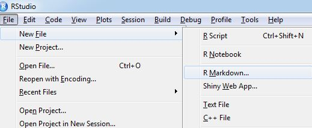
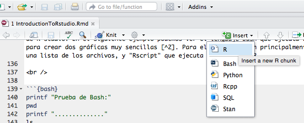

<style>
p.caption {
  font-size: 0.78em;
}
</style>


```{r setup, include=FALSE}
knitr::opts_chunk$set(echo = TRUE)
```


<br />

## I. R Studio


R Studio es una plataforma gratuita que facilita el uso del lenguaje de programación interpretativo *R*[^1], el cual usaremos durante el curso. Es un lenguaje orientado a realizar análisis estadísticos y uno de los lenguajes más utilizados a nivel mundial en Actuaria y Ciencia de Datos.

En un sentido más estricto, R Studio es un entorno interactivo conocido como **_IDE (Entorno de Desarrollo Integrado)_**. En general, se puede crear código de R en un editor simple de textos o en editores de código especializados (e.g. Sublime Text y Notepad ++) para más tarde *compilar* ("correr" o ejecutar un programa). Sin embargo, con el uso de un IDE se pueden realizar múltiples actividades en un mismo lugar, lo cual se vuelve efectivo al estar evaluando modelos y manejando todo tipo de datos. Dichas actividades se presentan en el IDE a través de una interfaz gráfica (*GUI*), mostrando ventanas individuales para visualizaciones, paqueterías, código y resultados, entre otros. 

Es importante mencionar que éste entorno está especializado en R, y aunque tiene compatibilidad con otros lenguajes, existen softwares que ofrecen mayores ventajas para lenguajes de programación específicos. Por ejemplo, *Anaconda* que utiliza Jupyter Notebooks y Spyder, con excelentes herramientas para el lenguaje de programación **Python**, al cual haremos referencia en múltiples ocasiones durante el curso, con el fin de poder comparar ambos lenguajes y conocer de manera generalizada los conceptos/algoritmos fundamentales de programación en el área de Ciencia de Datos. 


Actualmente no sólo se trabaja en la compatibilidad de lenguajes, los desarrolladores de estos IDEs trabajan constantemente en incrementar conexiones con servicios externos. Durante el curso vamos a hacer uso del servicio llamado **Github**, que consiste en un control de versiones para Git (*version control*). Github permite llevar un récord preciso de todos los cambios que se hacen a los códigos y proyectos. Es un servicio muy utilizado para realizar códigos complejos y colaborativos, ya que almacena de manera pública y gratuita los códigos (aunque también ofrecen el servicio de almacenamiento privado) y además mantiene registros para saber quién, cuándo y cómo suceden los cambios[^2].
 
 

******
<br />


## II. R Markdowns


R Markdowns es un formato que ofrece R Studio (archivo con extensión **.rmd**) para crear reportes donde se pueda incluir código (e.g. R, Python, C++ y SQL), texto simple, ecuaciones en LaTeX, links, imágenes y otras herramientas dinámicas. Los reportes creados pueden ser exportados a un PDF, a una página HTML o un archivo de Word. Esto permite compartir el material de manera simple y rápida. 


Para crear un R Markdown, se utiliza un tipo de lenguaje conocido como *marcado* o *de marcas* (markdown / tags) y es útil para el desarrollo de aplicaciones, ya que consolida y documenta toda las referencias/configuraciones. En palabras sencillas para entender el markdown en el contexto de computación científica tenemos lo siguiente:


**R** tipo de lenguaje: funcional, imperativo, orientado a objetos  **-->** dinámico **-->** ejecuta aplicaciones y permite el manejo de datos .
<br /><br />
**HTML** tipo de lenguaje: marcas de hipertexto **-->** estático **-->**  presenta interfaces (display) y hace referencia a herramientas externas (paqueterías, *scripts*, etc..)
<br /><br />
**XML** tipo de lenguaje: marcas extensibles **-->** estructurado **-->** documenta, auto-describe y da referencia a distintos lenguajes.

<br />
En este curso haremos uso de R Markdowns para crear las notas de clase. Los alumnos deberán usarlos para las tareas y el proyecto final[^3]. 

<br />
A continuación se muestran los detalles del código para agregar formato:
<br />
<br />


> **Ecuaciones**

Software libre con un lenguaje de marcado que permite reproducir ecuaciones y matrices. Para mayor detalle sobre este lenguaje pueden buscaran [LaTeX-Project](https://www.latex-project.org/). Si están interesados en hace alguna publicación, tesis o algún documento científico (incluso colaborativo), se recomienda usar [OverLeaf](https://www.overleaf.com/latex/templates). Como tip extra, para cualquier duda breve de LaTeX, pueden usar [Detexify](http://detexify.kirelabs.org/classify.html), aquí solo tienen que dibujar los símbolos que necesitan.


<br />
Código: 

`\begin{equation}
\begin{matrix}
  a & b  \\
  d & e  
 \end{matrix}
\end{equation}`

<br />
Resultado:


\begin{equation}
 \begin{matrix}
  a & b \\
  d & e 
 \end{matrix}
\end{equation}

<br />

> **Imágenes**

Se pueden incluir imágenes desde la web o guardadas en el mismo folder que el archivo .rmd 


<br />
Código:

``

<br />
Resultado:




<br />

> **Formatos**

* Hashtag (number sign) -> titles
* \*asterisk\*  \_underscores\_  -> *emphasize* 
* \**double asterisks\**  \__double underscores\__  -> __bold__
* [Y otras referencias...](https://nbviewer.jupyter.org/github/UNAMCiencias-Seminario-CienciaDeDatos/Seminario_Ciencias/blob/master/Programming/rmarkdown-cheatsheet.pdf)


******
<br />


## III.  Consola / Terminal 

<br />
La *Consola*, también conocida como *Terminal, Unix Shell, o Command Line Interpreter* (dependiendo el Sistema Operativo y entorno) es una aplicación que otorga al usuario el control sobre el Sistema Operativo, a través del código tipo *Unix/Bash*.  En otras palabras, los términos anteriores se usan de manera indistinta, por estar altamente relacionados, para referirse a la interacción del usuario con la máquina. 

<br />
**Por qué es importante conocer estos términos?** Hoy en día el uso de estos comandos es cada vez mayor debido a que permiten automatizar procesos. Por ejemplo, dependiendo el tipo de datos que se tengan (normalmente datos a gran escala), algunas veces es necesario descargar, unir, cortar, comprimir o convertir archivos desde la *Consola* con el fin de optimizar tiempos. Además, es importante conocer lo que hay detrás del lenguaje de programación que utilizamos y otras maneras de ejecutar programas o instalar paqueterías (sin el uso de IDEs). 

<br />
En particular, los R Markdowns (igual que los R Notebooks) tienen la ventaja de poder correr este lenguaje en la plataforma de R studio. En el siguiente ejemplo podemos ver el lenguaje Bash que ejecuta un *Script* de R para crear dos gráficas muy sencillas [^4]. Para ello se utilizan principalmente "ls" que hace una lista de los archivos, y "Rscript" que ejecuta el código en R.

<br />

```{bash}
printf "Prueba de Bash:"
ls
printf ".............."
ls files/
printf ".............."
Rscript files/RscriptDemo.R
ls  files/
```

<br />
Otras ventajas que tiene la Consola/Shell es la creación y movimiento de archivos o carpetas. Se pueden renombrar, crear y transferir de manera breve. Estos sencillos aspectos se vuelven cruciales en los procesos de automatización de actividades diarias (tanto a nivel profesional como para diversas áreas de investigación). Con el siguiente ejemplo vamos a renombrar las gráficas anteriores, cambiando el nombre de "graph" a "plot". En este caso se usa la estructura "for", se llaman las variables (que ayudan a reemplazar el texto) con el signo $ y se renombra con "mv". 


```{bash}
ls -l files/
printf ".............."
old_text='graph'
new_text='plot'
for file_i in files/*.png; do
    new_file_i=${file_i//$old_text/$new_text}
    mv "$file_i" "$new_file_i"
done
ls -l files/
```


<br />
En el ejemplo anterior, la lista de archivos incluye una descripción del archivo. Esto se debe a que agregamos el atributo/argumento "-l" en el comando "ls". Por ahora con eso es suficiente pero durante el curso se mostrarán otros comandos para el manejo de datos.


******
<br />


## IV. Código en R
<br />

Finalmente, como parte de la introducción de R Studio, se necesita conocer la herramienta que permite correr código en R. Cuando se crea un nuevo Script basta con escribir el código y ejecutarlo, mientras que en un R Markdown se debe agregar una sección ("chunk") de código, y  seleccionar el lenguaje R de la siguiente forma:

<br />


<br />

<br />
Existe la posibilidad de mostrar/ocultar el código en el reporte final (HTML, PDF o Word). A continuación se pueden ver ambos casos:

> **Mostrar código**
<br />

```{r cars}
summary(cars)
```


<br />
<br />


> **Ocultar código**

<br />
```{r pressure, echo=FALSE}
plot(pressure)
```


[^1]: [Notas auxiliares](https://nbviewer.jupyter.org/github/UNAMCiencias-Seminario-CienciaDeDatos/Seminario_Ciencias/blob/master/RNotebooks/01_Notebook_IntroRStudio/1_Notebook_ParadigmasDeProg.html) de lenguajes de programación

[^2]: Guía baásica de [Github (link)](https://guides.github.com/introduction/git-handbook/)

[^3]: Para más detalles [R Markdown: The Definitive Guide](https://bookdown.org/yihui/rmarkdown/)

[^4]: Aquí hay una muy buena/reciente referencia [DataScienceAtTheCommandLine](https://www.datascienceatthecommandline.com/). Para más detalles también pueden visitar [Bash Beginners Guide](http://www.tldp.org/LDP/Bash-Beginners-Guide/html/)