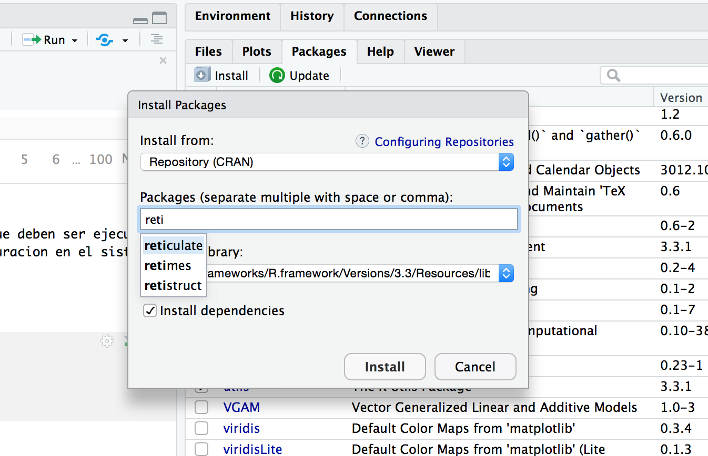

 
<style>

p.caption {

  font-size: 0.75em;

}

</style>

 

 

```{r setup, include=FALSE}

knitr::opts_chunk$set(echo = TRUE)

```

 

 

<br />

 

## I. Motivación para la solución de problemas

 

<br />

Para entender este curso es importante saber que no consiste en una serie de pasos exactos y resultados únicos, se trata de un curso para conocer claramente los conceptos técnicos y aplicaciones de Ciencia de Datos que han ido evolucionando en distintas áreas de estudio. Nos vamos a orientar principalmente en el Mercado de Capitales, por ser nuestra área más fuerte de experiencia, sin embargo, las herramientas que vamos a utilizar tienen un alcance mucho más grande en Matemáticas, Seguros, Negocios, entre otros.

 

<br />

El motivo fundamental es proponer una nueva metodología de trabajo y una alternativa a la orientación del pensamiento analítico que los alumnos desarrollan durante los primeros semestres de Actuaría. Tal cual nosotros lo hicimos, queremos mostrar cómo se puede combinar dicho pensamiento con aplicaciones tecnológicas. Tenemos la confianza en que estas habilidades les permitirán estructurar modelos cuantitativos desde otra perspectiva, tanto a nivel académico como profesional, y a cualquier escala (*Muestreo* o *Big Data*). Esta propuesta se irá adaptando al perfil e interés por parte de los alumnos. La idea principal es que sea un ambiente dinámico donde irán descubriendo distintas estrategias para la solución de problemas.

 

 

<br />

 

## II. Tipos y estructuras de datos 

 

<br />

En la clase anterior se mencionaron los principales aspectos de la plataforma que vamos a usar (R Studio). En esta ocasión vamos a conocer un poco más acerca del manejo de datos en el lenguaje R.

 

<br />

**¿Qué forma tienen los datos?** Actualmente la cantidad de información que se genera día con día es enorme, y no sólo eso, las fuentes de origen siguen incrementando, ya sea en medios de comunicación, proyectos de investigación y sistemas de negocio, entre otros. Toda esa información podemos utilizarla para la solución de problemas y toma de decisiones, pero para darle el uso correcto es importante aprender a **conocer los datos** y el potencial que tienen.


```{r, out.width = "500px", echo=FALSE, fig.align = "center"}
knitr::include_graphics("images/datagrowth.jpg")
```

<br />
Como probablemente han visto en cursos básicos de R, los datos y modelos se almacenan en espacios de memoria a través de **variables**. Dichas variables se identifican usualmente por nombres que combinan letras mayúsculas y minúsculas, números y, en algunos casos, guiones y puntos. Además son dinámicas, es decir, cambian el tipo de dato almacenado cada vez que se les asigna un nuevo objeto (es importante considerar los limites y el manejo de memoria [^1]).

<br />
Vamos a comenzar por mostrar estructuras y tipos en **R**. Es importante que esta terminología la conozcan en ingles, ya que es el lenguaje que se usa para las declaraciones.


<br />
**Tipos de datos**

  * Booleans / Lógicos
  * Character / String
  * Numeric
  * Integer
  
<br />

```{r}
# Booleans
x <- TRUE
x
class(x)

# Cast TO STRING
x <- toString(x)
x
class(x)

# Numerics and integers
y <- 9
class(y)
z <- as.integer(y)
class(z)

# Characters / Strings
z <- "example"
class(z)
```

<br />
**Estructuras de datos:**

  * Vector
  * Matrix
  * List
  
<br />


```{r}
# Vectors: many elements of the SAME type
vector1 <- c(1,2,3,"4")
vector1
class(vector1)

vector1 <- seq(1,3,by=0.5)
vector1
class(vector1)

vector1 <- 1:10
vector1
class(vector1)

# Matrix: Two dimensions | Array: More dimensions
matrix.ex <- cbind(c(10,20,30),c('a','b','c'))
matrix.ex 
class(matrix.ex )

dim(vector1) <- c(2,5)
vector1

matrix.ex <- matrix(1:10, nrow = 5, ncol = 2)
matrix.ex

# List: many elements, MANY types (array + hashmap) and RECURSIVE
list.ex <- list("type1" = 10, "type2" = FALSE, "type3" = c(1,2,3))
str(list.ex)

list.ex$type1
list.ex[c("type1")]

```


<br />


Ahora veamos los mismos **tipos y estructuras de datos** pero en esta ocasión en **Python**:

```{python, engine.path="/anaconda/bin/python"}

some_integer  = 5
some_float = 7.12
some_string = "Student"

print (some_integer)
print (some_float)
print (some_string)

print ("My integer is " + str(some_integer) + ".")
print ("My float converted into integer is " + str( int(some_float) ) + ".")

```

```{python}
some_list = [0.8,0,1,2,3,3,4.5,7.6]
print ("This is a list:  " + str(some_list))

print some_list[1]
print some_list[0:2]
```


 <br />
 
Y podemos encontrar algunas ventajas en estructuras mas específicas como las siguientes:
 
> Dictionary

dict( ) or a faster approach {key1: value1, key2: value2} 

  - {prices: [100, 101, 109], action: ["buy","sell"]}
  - Pair made of a key and a value, similar to objects (one value for each attribute = key).
  - Similar to *JSON-format* but instead of a 'string' format, this is a structure with memory (in-memory object).

> Tuples

( "price", "action" ) or 
( 100, "buy" )

  - Ordered sequences of objects, immutable. 
  - Similar to arrays. Less Memory used.
  - Faster than lists and they can be used in dictionaries.
{ ("price","action"): (100,"buy"), ("hour","minute"): (14,58) }

> Sets

set( [100, 101.2, 100, 101, 100] )

  - Mutable unordered sequence of unique elements
  - Similar to arrays but without duplicated values (unique)
 
 
 <br /> 
 
 
```{python python.reticulate=FALSE}
some_tuple = ('a','b')
some_dictionary = {'student1': '(929)-000-0000', 'student2': '(917)-000-0000', 'student3': '(470)-000-0000'}
some_set = set( [1,2,4,4,5,5] )

print ("This is a tuple:  " + str(type(some_tuple)) + str(some_tuple) )
print ("This is a dictionary:  " + str( some_dictionary ))
print ("This is a set:  " + str( some_set ))

```

 
<br />


## III. Extracción de Datos y Tipos de Almacenamiento

<br />

Una vez que entendemos la importancia de cada estructura, podemos pensar en diversas estrategias de solución a un problema. Un buen comienzo consiste en poder resolver los siguientes cuestionamientos acerca de los datos en cuestión: *¿de qué tipo son?, ¿cuál es su escala?, ¿cuál es el tamaño de la muestra?, ¿cuál fue el proceso de extracción/creación?, ¿con qué temporalidad se pueden seguir obteniendo muestras?, ¿qué información adicional podemos conseguir a través de ellos?, ¿cuál es la calidad de la información?, ¿cuál es la forma más clara en que pueden ser representados?, ¿el problema a resolver consiste en un procesamiento de datos de manera continua (e.g. en tiempo real) o se busca un resultado en específico?.* Solo por mencionar algunas ideas.

 

<br />

Gran parte de esas respuestas requieren del uso de *Estadística Descriptiva* y conceptos básicos de *Muestreo*[^2], con los cuales deben estar muy familiarizados. No todas estas preguntas van a poder tener una respuesta precisa al inicio de un proyecto, pero eso está bien, ese es justamente el objetivo inicial: Incrementar y extraer conocimiento de lo que tenemos a disposición (si, más información.).

 

<br />

Dicho esto, vamos a partir por los principios fundamentales durante el proceso de extracción (**_extraction / collection_**) en el campo de **_Data Mining_**.


<br />

 

  * Datos tabulados y estructurados: Separados por renglones, columnas y divisiones.

 
    + Los podemos encontrar de manera informal (sin detalle acerca del contenido) en **_documentos de tipo csv, xls, txt, tsv..._** Estos archivos son compatibles con diversas aplicaciones y lenguajes (como R y Python) donde los datos se pueden observar y transformar con ayuda de un par de lineas de código. Empezaremos por usar la Terminal para ubicar el documento.
    
```{bash}
ls
mkdir files
mv CURVAS_BONO_M.csv files/CURVAS_BONO_M.csv
ls
cd files
ls
```
      
      - Una vez ubicado podemos observar los datos, ordenarlos y obtener detalles básicos como contar la cantidad de lineas de este archivo.
      
```{bash}
HEAD files/CURVAS_BONO_M.csv 
printf "**********************\n"
TAIL files/CURVAS_BONO_M.csv 
printf "**********Counts per line************\n"
wc -l files/CURVAS_BONO_M.csv 
```

      - Podemos de igual forma crear archivos únicamente con la información que necesitamos.


```{bash}
cut -f 1,3 -d',' files/CURVAS_BONO_M.csv | head
printf "**********************\n"
cut -f 1,2  -d',' files/CURVAS_BONO_M.csv | sort | head -15
printf "**********New file************\n"
cut -f 1,2  -d',' files/CURVAS_BONO_M.csv | sort > files/CURVAS_BONO_M_CUT.txt
```

<br />

  * De manera formal, integral y sistemática existen las **_Bases de Datos_**, las cuales se almacenan y conectan en un software llamado Sistema *Gestor* o *Manejador* (database-management system) con accesos directos para que los usuarios capturen y analicen los datos[^3]. 
  
    + Por ahora vamos a referirnos (como ejemplo) a las Bases de Datos relacionales, que cuentan con tablas, vistas y procedimientos creados en lenguajes como *SQL (Structured Query Language - Microsoft)* o *MySQL (Open source - Oracle)*. Más adelante hablaremos de otros tipos de Bases de Datos, por ahora basta con recordar que las Bases de Datos tienen información acerca del contenido (*metadata*), herramientas muy avanzadas de protección de datos y diseños que mejoran la calidad de la información (evitan duplicar y tratan de optimizar la cantidad de transacciones durante el proceso de análisis, entre otros). Para extraer información o analizar estos datos con un nivel de complejidad bajo/intermedio se deben conocer sus grupos/objetos principales (*schema*) y relaciones, mientras que en un nivel más avanzado se usan servicios como *Microsoft SQL Server Analysis Services*, donde existen *cubos* de arreglos de datos multidimensionales.

 <br />
   
```{r, out.width = "500px", echo=FALSE, fig.align = "center"}
knitr::include_graphics("images/msql.jpg")
```
 
 <br />

  * Datos no estructurados: Sin divisiones ni símbolos específicos.

    + En esta categoría encontramos información concentrada en **_archivos o Bases de Datos compuestas por texto e imágenes_**. El análisis de este tipo de datos no consiste en columnas especificas, si no en una seria de valores que pueden combinarse, y para ello se requiere de una transformación importante con modelos de Estadística y Ciencias de la Computación (por ejemplo, se pueden transformar palabras en variables). El campo de estudio base es el de Inteligencia Artificial (AI) pero dependiendo el contexto, la cantidad de datos y la complejidad del aprendizaje esperado, se desarrollan modelos relacionados con *Machine Learning*, *Deep Learning*, *Natural Language Processing (NLP)* y/o *Neural Networks*, principalmente. Durante el curso estaremos utilizando términos de estas áreas para que conozcan los fundamentos y puedan desarrollar bases adecuadas para avanzar al siguiente nivel de investigación.
    
    <br />
    
  * Datos en la web: Múltiples formatos y patrones.

    + Cualquiera de los tipos de datos mencionados hasta el momento pueden encontrarse no solo como archivos o Bases de Datos, actualmente existen muchas herramientas para extraer los **_datos desde la Web_**. Muchas veces cuentan con patrones específicos construidos con formatos como **_HTML, XML y JSON[^4]_**, entre otros. Este proceso de extracción es mejor conocido como **_Web Crawling o Web Scraping_**, durante el curso vamos a aprender algunas de las técnicas más relevantes para extraer y procesar dichas estructuras.
    
<br />


```{r, out.width = "500px", echo=FALSE, fig.align = "center"}
knitr::include_graphics("images/webcrawling.jpg")
```
 

<br />

 

## IV. Uso de paqueterías y funciones --- Leer datos 

<br />

Como probablemente han aprendido en algunos cursos anteriores, los Lenguajes de Programación cuentan con paqueterías/librerías y funciones (built-in functions) que ayudan a resolver algunas tareas complicadas con un par de lineas de código. Este es el caso de los modelos de Inteligencia Artificial, técnicas de extracción de datos, limpieza y aplicaciones interactivas. Durante las siguientes semanas estaremos aprendiendo a programar nuestros modelos teóricos y veremos también como utilizar las librerías de apoyo. No podemos dar una lista completa de las paqueterías más importantes, ya que están en constante evolución. Los desarrolladores (y cualquier persona que quiera construir sus paqueterías personales!) están siempre pendientes, no sólo porque las versiones de los lenguajes de programación van cambiando, también se adaptan a las necesidades del usuario. Sin embargo, las estarán conociendo de acuerdo al tipo de actividad que desarrollemos y hablaremos sobre como entender su documentación.

<br />

Debemos tener muy en cuenta que cada paquetería sigue su propia estrategia de solución y, dependendiendo cual usen, podrían obtener distintos resultados. Además, cuentan muchas veces con *dependencias*, es decir, para funcionar requieren de otras paquetería. La instalación es bastante sencilla desde **R Studio**, por ejemplo *reticulate*, que sirve específicamente para que al correr código de Python en R Notebooks, se recuerden las variables en las siguientes celda / chunk.

<br />

```{r, out.width = "500px", echo=FALSE, fig.align = "center"}

```
 

<br />

En el siguiente código vamos a usar una función (built-in) existente en **R** para leer archivos CSV.

<br />

```{r}
table <- read.csv(file="files/CURVAS_BONO_M.csv", header=TRUE, sep=",")
head(table)
```


<br />

En el caso de **Python**, que usa el IDE de **Anaconda / Jupyter Notebooks**, se requiere de comandos que deben ser ejecutados desde la Terminal (e.g. **_Conda_** y **_Pip_**) para instalar paqueterías, y deben actualizarse para la mejora de errores o cambios de versión. Aquí podemos ver la librería *Pandas* para leer el mismo archivo CSV.

<br />

```{python}
import pandas as pd
table = pd.read_csv("files/CURVAS_BONO_M.csv")
print table.head()
```


<br />


[^1]: Detalles acerca de la memoria: [Memory, *Advanced R* by Hadley Wickham](http://adv-r.had.co.nz/memory.html)

[^2]: Referencias para métodos básicos de Muestreo: *Sampling Techniques*, 3rd Edition
William G. Cochran, y *Sampling Statistic*. Wayne A. Fuller (2009).

[^3]: Referencia online y biliografía: [Principles of Database and Knowledge Base Systems, Jeffrey D. Ullman, Computer Science Press](https://www.sti-innsbruck.at/sites/default/files/Knowledge-Representation-Search-and-Rules/principles-of-database-and-knowledge-base-systems-volume-1-1.pdf)

[^4]: En [esta liga](http://nbviewer.jupyter.org/github/mariazm/website_resources/blob/master/JSON_formats_scrapping_ElasticSearch.ipynb) pueden encontrar cómo trabajar con el formato/notacion tipo JSON (para futuras referencias). Para los objetivos del curso es suficiente con entender en qué consiste este formato y sus atributos principales.