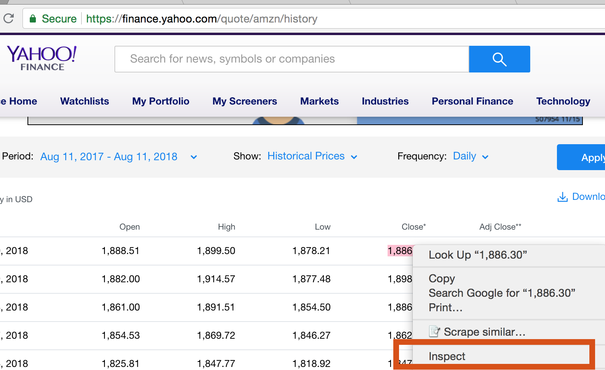
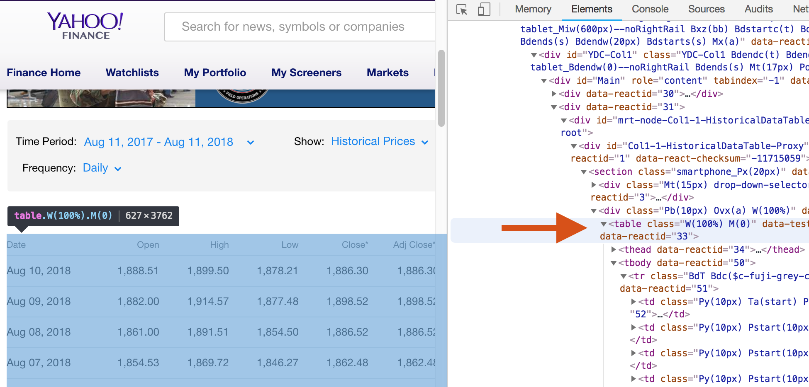
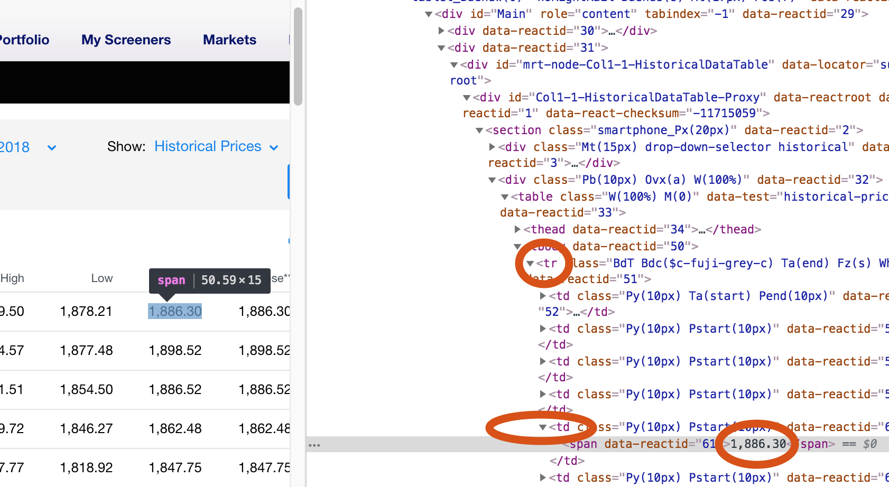

<style>
p.caption {
  font-size: 0.75em;
}
</style>

```{r setup, include=FALSE}

knitr::opts_chunk$set(echo = TRUE)

```

<br />

## I. Introducción

<br />
Como hemos estado mencionado durante clase, hay muchos ejemplos por conocer y desarrollar en el área de Capitales con ayuda de Ciencias de la Computación y Ciencia de Datos. Desde la automatización de procesos básicos de valuación diaria, hasta la investigación/estrategia de mercado y el aprendizaje automático para la toma de decisiones. Sin embargo, conforme aumenta el nivel de posibilidades, aumenta también el riesgo. Debido a la complejidad en los mercados, la variedad de instrumentos y la cantidad de información disponible, es importante que los modelos que se realicen tengan en consideración, no solo los rendimientos y la optimización, también los riesgos implícitos tanto para la inversión que se está diseñando, como para los agentes externos. 

<br /> 
Entonces, existiendo tantas posibilidades.. Con qué tipo de datos podemos iniciar? Qué problemas vamos a resolver? Cómo ya mencionamos la clase pasada, un buen comienzo es entender los datos y para ello no solo vale la pena ver el formato que tienen, si no entender el contexto al cual se refieren. En el Mercado de Capitales no existe un contexto único, aunque frecuentemente se analiza con base en tipo de instrumentos (corto o largo plazo, **renta fija o variable**), también puede analizarse desde la perspectiva de organización del mercado (**OTC o regulado**) o del punto de ejecución de la inversión (**mercado primario** durante la emisión, o **mercado secundario**). Para cualquiera de los casos anteriores podemos utilizar datos como *indices, precios, tasas, medidas de sensibilidad, calificaciones,* y *rendimientos*, entre otros.. mismos que requieren de valuaciones donde el tiempo y la incertidumbre son factores fundamentales. Los cambios en estos datos dentro del Mercado de Capitales pueden darse por día, hora, minutos e incluso segundos (depende del tipo de instrumento y la liquidez del mercado). Y este es precisamente un atributo que también existe en estos Lenguajes de Programación (R y Python), las funciones de Probabilidad.
 
 <br />
Si buscamos ideas para hablar de Probabilidad podemos pensar en dos herramientas altamente involucradas en el tema de inversión, como son las **simulaciones** y los **escenarios de estrés**. De hecho, dichas herramientas están también involucrados con otras aplicaciones más complejas de Ciencia de Datos y de la Computación, como es el proceso de automatización (Algorithmic and Automated Trading). En otras palabras, podemos usar simulaciones y escenarios de estrés para calcular la probabilidad de ganancia/perdida y la sensibilidad en una inversión, pero también podemos crear procesos parar generar alarmas cuando se presenten cambios que puedan romper las tendencias del mercado. En este caso, vamos a empezar con las funciones de Probabilidad, y a lo largo del curso iremos aprendiendo sobre automatización.


<br />

## II. Funciones de Probabilidad

<br />
Podemos encontrar distribuciones discretas y continuas, todas tienen una letra (prefijo) para distinguir el tipo de resultado que se busca, así como una abreviación para identificar la distribución.

<br />

1. Distribuciones Discretas

<br />

  * **dbinom probability mass function $P(X = k)$** 
  * **pbinom distribution $P(X <= k)$**
  * **qbinom quantiles**
  * **rbinom  pseudo-random number generators of a given probability **

<br />
  
```{r echo=FALSE, results='asis'}
library(knitr)
Distribucion_Discreta <- c('Binomial','Binomial Negativa','Poisson','Geométrica','Hipergeométrica')
Distribucion_en_R <- c('binom','nbinom','pois','geom','hyper')
kable(cbind(Distribucion_Discreta,Distribucion_en_R))
```
  
<br />

```{r}
############ Binomial 
#help(dbinom)
dbinom(6,7,0.5)
pbinom(6,7,0.5)

# Number of successes that will happen with this probability after 7 trials
qbinom(0.25,7,0.5)

dbinom(0:8,7,0.5)
barplot(dbinom(0:8,7,0.5),names.arg=0:8,xlab="k",ylab="dbinom",main="Binomial",col=c("darkblue"))
```


<br />

Simulación con base en parámetros definidos n=7, p=0.5

```{r}
########### 20 samples (independent) of the num of successes in 7 trials with prob=0.5 of success 
sim <- t( table(rbinom(20,7,0.5)) )
prop.table(sim )
```

```{r}
########### 100 samples (independent) of the num of successes in 7 trials with prob=0.5 of success 
sim <- t( table(rbinom(100,7,0.5)) )
prop.table(sim )
```

```{r}
########### 1000 samples (independent) of the num of successes in 7 trials with prob=0.5 of success 
sim <- t( table(rbinom(1000,7,0.5)) )
prop.table(sim )

round( dbinom(0:7,7,0.5), digits=3 )
```


<br />

2. Distribuciones Continuas

<br />

  * **dnorm density function $f(x)$**
  * **pnorm distribution $P(X <= k)$**
  
<br />
  
```{r echo=FALSE, results='asis'}
library(knitr)
Distribucion_Continua<-c('Normal ','Exponencial ','Uniforme ','Logística ','Lognormal ','Gamma ','T-Student ','Chi-Cuadrado ','Beta')
Argumentos<-c('µ = mean σ = sd x','λ = rate ','(a, b) ','t = location s = scale ','µ = meanlog  σ = sdlog ','p = shape α = scale ','n = df t','n = df ','p = shape1 q = shape2 ')
Distribucion_enR<-c('norm','exp','unif','logis','lnorm','gamma','t','chisq','beta')
kable(cbind(Distribucion_Continua,Distribucion_enR,Argumentos))
```
  
  
<br />

```{r}
############ Normal
#help(dbinom)
dnorm(120, 150, 15)
pnorm(120, 150, 15)
qnorm(0.9, 150, 15)
```

<br />

Simulación y distribución

```{r}
# Batch of 24 samples with mean=150, stdev=15
Xday <- rnorm(24, 150, 15)
# Get frequency
hist(Xday ,freq=FALSE, col="darkblue")
curve( dnorm(x,150,15), xlim=c(100,200), col="red",lwd=3,add=TRUE)
```

<br />

## III. Creación de otras funciones en R y Python - Intro to Sampling

<br />
Con ayuda de R y Python podemos también crear nuestras propias funciones. Las funciones ejecutan y definen operaciones/transformaciones que hacemos con los datos para poder ser usadas en múltiples ocasiones, evitando repetir código. Para definir los aspectos que si queremos cambiar cada vez que mandemos llamar esas funciones, existen los argumentos (también conocidos como parámetros).

<br /> 
Para entender mejor el uso de las funciones y el tema de **simulación**, vamos a hablar de muestras. Por ejemplo, vamos a crear una muestra con distribución de tipo Normal, de tamaño 24, para simular un precio por cada hora del día con base en parámetros conocidos $ \mu =150$ y $ \sigma =15$. En este caso el tamaño de la muestra será el único argumento (**nSampleSize**) que podremos cambiar cada vez que se mande llamar la función.

<br /> 

```{r}
# Now let's do more samples (one per Business Day) of those batches (24 simulations, one per hour)
meanFunction <- function(nSampleSize){ return (mean(rnorm(nSampleSize,150,15))) }
sampleMeanAllDays <- replicate(252, meanFunction(24))
mean(sampleMeanAllDays)
```

<br /> 

Vamos a hacer lo mismo con Python

<br /> 

```{python engine.path="/anaconda/bin/python" , python.reticulate=FALSE}
import numpy as np
def meanFunction(n): return np.mean( np.random.normal(150, 15, n) )
sampleMeanAllDays = [meanFunction(24) for i in range(252)]
print "Mean = " + str(np.mean(sampleMeanAllDays))
```

<br />

Ahora, continuando con **R**, si sólo contamos con un día de muestra (24 horas) y usamos esas observaciones para generar nuevas muestras con **reemplazo**? Necesitaríamos conocer el tipo de distribución que siguen los datos? Esto lo podemos analizar si usamos la muestra "Xday" para simular otro día, y así 252 días.


<br />

```{r}
Xday 
otherXday <- sample(Xday, 24, replace=TRUE)
otherXday
```

<br />
 Qué pasa si conocemos los parámetros de la distribución? En que casos es razonable cada uno de estos supuestos?  Para entender esto necesitamos referirnos a algunos conceptos básicos de **creación y validación de muestras**.

  - Principales tipos de muestreo: *Muestreo aleatorio simple, Muestreo estratificado (estratos conocidos) o por Conglomerados (grupos no definidos de manera precisa)*.
  - Errores típicos durante el proceso de muestreo: **Bias** (non-random *method*) y **Leakage** (prediction data included in the model -  distorting information) [^1]. 

 
 <br />
 Dicho lo anterior, el proceso de muestras con reemplazo es mejor conocido como **Bootstrapping (Resampling)** y justamente se utiliza cuando tenemos una muestra representativa  e independiente (non-heavy-tailed). En dicha muestra no deben existir autocorrelaciones (para series de tiempo existe **block bootstrap**), y se espera que la varianza corresponda a la misma distribución de probabilidad (heteroscedasticity).
 
<br />

  * Bootstrapping the [Zero coupon yield curve - Construction]( http://www.iotafinance.com/en/Article-The-construction-of-a-zero-coupon-yield-curve-by-the-method-of-bootstrapping.html)
    + Motivation:  Relation between Yield-to-maturity (bond’s expected return) on a zero coupon bond and another bond's maturity - Benchmark - Spread
    + Common data used: Libor, Future/Forwards and Swap rates. 
    + Additional steps: Interpolate missing periods.
    
<br />
    
  * Bootstrapping for multiple imputation of missing data 
    + Field: Social sciences / Surveys / Incomplete subjects and entities
    + Expectation-maximization approach with rectangularized versions vs listwise deletion. Multivariate norma distribution predicted.
    + R package: [Amelia II](https://gking.harvard.edu/files/gking/files/amelia_jss.pdf)
    + Works fast with a large number of variables
    + Other authors: Rubin and Schenker (1986), Rubin (1994), and Shao and Sitter (1996)
 
 <br />
En este mismo contexto de simulaciones, existe el método **Montecarlo**[^2] que corresponde al uso de algoritmos con distribuciones especificas. Estos algoritmos calculan muestras que se evaluan/comparan con estadísticos, pruebas de hipótesis y otras distribuciones (pruebas de ajuste y comparación de medias, por ejemplo). Y por último, vamos a introducir uno de los métodos más importantes para validar muestras y modelos en Ciencia de Datos, dicho método será aplicado en repetidas ocasiones durante el curso: **Cross Validation** (out-of-sample testing). Este método consiste en el manejo de distintas particiones de la muestra de datos reales para crear y validar modelos predictivos, combinando los resultados finales.


 <br />

## IV. Datos del mercado en la Web

<br />
Como parte de esta introducción al tema de Datos en el Mercado de Capitales, y con el fin de empezar a construir ejemplo con datos reales, es importante conocer el método de extracción de datos en la Web, conocido como **scrapping o web crawling**. Estos conceptos corresponden únicamente al hecho de extraer información, sin embargo, existen múltiples formas de hacerlo y distintas posibilidades para la estructura con que almacenamos los datos extraídos. Sin embargo, siempre partimos por entender la página Web en cuestión.


<br /> 
En este caso vamos a descargar los precios de una acción desde el sitio de **Yahoo-Finance**. Para ello necesitamos primero entender como esta construida la página y eso podemos hacer desde el navegador (e.g. Chrome), buscando palabras clave, archivos y patrones existentes.

<br /> 
```{r, out.width = "700px", echo=FALSE, fig.align = "center"}

```
<br /> 
```{r, out.width = "700px", echo=FALSE, fig.align = "center"}

```
<br /> 
```{r, out.width = "700px", echo=FALSE, fig.align = "center"}

```
<br /> 


Una vez que tenemos claro el patrón que buscamos, debemos crear funciones que se adapten a los patrones, descargando los contenidos con librerías en R y Python especiales para este tipo de extracción de datos. En este caso usaremos la libreria de **BeautifulSoup**[^3] de **Python**, que tiene muchas herramientas sencillas de usar para encontrar patrones en HTML Y XML.
<br />

En esta caso vamos a crear una función con 2 argumentos, el nombre de la acción que queremos descargar y la cantidad de observaciones:


```{python eval=FALSE}
###### Create the function
def getYahoo_records(name, numRecords):
    
    records = dict( dates=[], prices=[])
    
    url = "https://finance.yahoo.com/quote/" + name + "/history/"
    HTMLtable = bs(  urllib2.urlopen(url).read(), "lxml" ).findAll('table')[0].tbody.findAll('tr')
    
    for row in HTMLtable:
        if len(records) < numRecords:
            dataPerColumn = row.findAll('td')
            #if dataPerColumn[1].span.text  != 'Dividend': 
            records['dates'].append( dataPerColumn[0].span.text )
            records['prices'].append( float(dataPerColumn[4].span.text.replace(',','')) )
    
    return records
```

```{python eval=FALSE}
###### Call the function and get output in the sample_stock variable (structure = dictionary)
sampleStock = getYahoo_records('amzn', 10)
```

```{python eval=FALSE, python.reticulate=FALSE}
###### Create a csv file with results of this dictionary
with open('sampleStock.csv','wb') as f:
    w = csv.writer(f)
    #### Header
    w.writerow( ('Dates','Prices') )
    #### Rows
    for i in range(10):
        w.writerow( (sampleStock['dates'][i],sampleStock['prices'][i]) )

```


<br />

Con esto, los resultados quedaron impresos en un archivo CSV:

```{r}
table <- read.csv(file="files/sampleStock.csv", header=TRUE, sep=",")
table
```


<br />


[^1]: Leakage examples: Test into the training set, future included with past, non-relevant and noisy information. [Link DataLeakage exmaple](https://www.kaggle.com/dansbecker/data-leakage) and [Link Data Leakage paper](https://www.cs.umb.edu/~ding/history/470_670_fall_2011/papers/cs670_Tran_PreferredPaper_LeakingInDataMining.pdf)

[^2]: Montecarlo reference: [Xiaoping Du, Missouri University of Science and Technology](http://web.mst.edu/~dux/repository/me360/ch8.pdf)

[^3]: [Documentation and examples](https://www.crummy.com/software/BeautifulSoup/bs4/doc/)