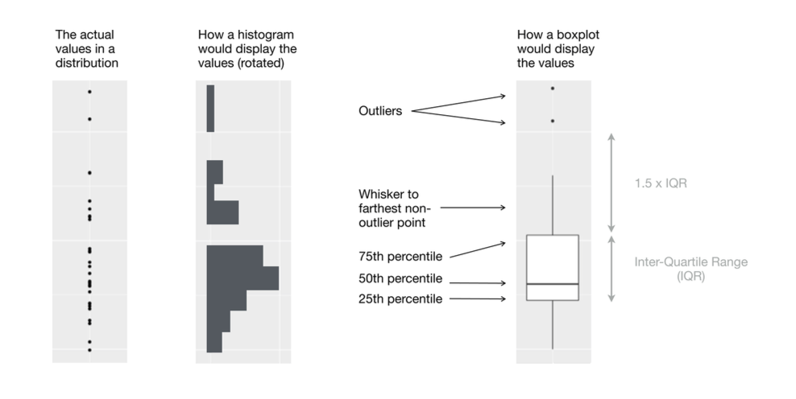
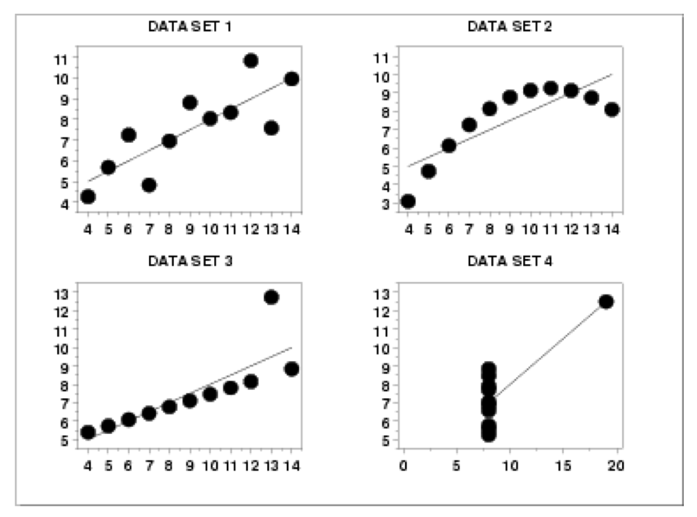

<style>
p.caption {
  font-size: 0.78em;
}
</style>


```{r setup, include=FALSE}
knitr::opts_chunk$set(echo = TRUE)
```


<br />


# 1. Normalización 

Una de las herramientas principales durante la creación de modelos es el trabajo de preparación de los datos, hasta ahora hemos visto como descargarlos, como conseguir información nueva y unirla, como obtener estadísticos descriptivos, como filtrar y agrupar, como crear distribuciones y usar estructuras de datos que simplifican todos estos procesos (e.g. dataframes). 

Ya hemos platicado acerca del proceso de muestras y algunos aspectos que debemos evitar durante la extracción: Bias y Leakage. Puede ser que se haya analizado lo suficiente el diseño de extracción para evitar contar con estos dos aspectos. Sin embargo, en caso de que no sepamos mucho sobre el diseño, un siguiente punto a considerar es el tema de normalización para cuando se presenten muestras sesgadas:

Para que nos sirve la normalización? Cada vez que trabajamos con datos para evaluar compañías o instrumentos financieros, debemos analizar la escala de las variables que estamos usando. Algunas pueden hacer referencia a aspectos monetarios de alguna compania, mientras que otras pueden representar en porcentaje el valor de los retornos. La mayoría de los modelos en Ciencia de Datos y Machine Learning hacen comparaciones generales de los datos, por lo cual esperaríamos que las diferencias en escalas no fueran un problema. Para ello vamos a mencionar dos ejemplos de normalización:

* Estandarización: Centrar los datos (restando la media) y escalar (dividiendo entre desviación estándar). Este es el mas común.

* Escalar en un rango: Podemos reasignar valoresnúmeros entre 0 y 1 (0 será el valorproporción mínimo y 1 el valor máximo de cada columna, reasignando todos los números intermedios en esta proporción).


# 2. Anomalías en los datos 

Una vez que tenemos preparados los datos y empezamos a trabajar en los estadísticos descriptivos, debemos ver con mas detalle las implicaciones de estos resultados. No solo se trata de hacer cálculos con la mejor predicción, se trata de usar modelos que vayan de acuerdo con la lógica del problema. Para esto, al obtener los estadísticos descriptivos e incluso después de la normalización, puede que nos demos cuenta de la existencia de nuevos problemas como los siguientes:

* Un exceso de valores inusuales y con alta influencia en la muestra 

* Un exceso de características/variables a evaluar en comparación con el tamaño de muestra - High dimensionality

Para ambos casos existen diversas estrategias, tanto en pequeña como en gran escala (Big Data). En esta clase vamos a cubrir aspectos principales para cada tamaño de muestra. Esto ya nos debe empezar a dar un panorama acerca de la relación que mantienen los datos entre si, ademas de los modelos que podrían aplicarse con base en los supuestos requeridos.


### 2.1 Diagnósticos - Distribuciones y relaciones 

Para referirnos al diagnostico de anomalías en una muestra de tamaño chico, vamos a utilizar la misma lista de compañías globales, seleccionando aquellas empresas que cotizan en bolsa y están localizadas en Mexico. En este sentido estamos trabajando con aspectos de los renglones de nuestro dataset (registros).


* La primera parte del código corresponde a leer, describir y filtrar el dataframe.

```{r}
##### Read the files 
globalCompanies <- read.csv("outliers_data/globalCompanies_sandp.csv")

##### Take a look to the size and columns
nrow(globalCompanies)
colnames(globalCompanies)

##### Summary
sapply(globalCompanies,class)
table(sapply(globalCompanies,class))
summary(globalCompanies$Country)[0:13]

##### Filtre
suppressMessages(library(dplyr))
mexComp <- filter(globalCompanies, Country=="Mexico")

```

<bar />

* Ahora, podemos agregar nuevas columnas con métricas de evaluación de la compañías y eliminar casos incompletos.

```{r}
### Capitalización de mercado 
mexComp$marketCap <- mexComp$currentPrice * mexComp$sharesOutstanding
### Apalancamiento o Leverage : Borrowed money (debt) to generate returns on investments
### Debt-to-EBITDA Ratio
mexComp$leverageEbitda <- mexComp$totalDebt / mexComp$ebitda
```


```{r}
##### Filter rows with missings
mexComp <- mexComp[complete.cases(mexComp), ]
nrow(mexComp)
```


* Para iniciar el análisis de anomalías a graficar una de las columnas que acabamos de crear

```{r}
plot(mexComp$leverageEbitda)
#identify(mexComp$leverageEbitda)
```

```{r}
mexComp[85,]
```

* Ahora vamos a utilizar algunas herramientas de visualización, para esto vamos a tomar la variable "fullTimeEmployee" donde podremos ver que los valores reales de esta columna no nos permiten ver correctamente la distribución. Para resolver esto hacemos una transformación con la función de logaritmo. Con esto vamos a seguir conservando la distribución y podemos volver a los valores originales con la función inversa (exponencial). Los valores de tipo monetario son los que comúnmente requieren de este proceso, particularmente porque suelen ser procesos mutiplicativos (cuyos incrementos se dan en porcentajes y no en diferencias de valor).


```{r}

###############  Histograms and log values
summary(mexComp$fullTimeEmployee)
hist( mexComp$fullTimeEmployee )
summary(mexComp$fullTimeEmployee )

summary( log(mexComp$fullTimeEmployee ) )
hist( log(mexComp$fullTimeEmployee ) )
summary(log(mexComp$fullTimeEmployee ) )
```


<br />


* En la siguiente gráfica podemos ver la comparación del resto de las variables que usaremos, en ambas escalas.

```{r echo=FALSE}
############### Create logs for numeric variables
par(mfrow=c(3,2))

var <- 'leverageEbitda'
hist( mexComp[,var], xlab=var, main = var)
var <- 'currentPrice'
hist( mexComp[,var], xlab=var, main = var)
var <- 'totalDebt'
hist( mexComp[,var], xlab=var, main = var)
var <- 'totalRevenue'
hist( mexComp[,var], xlab=var, main = var)
var <- 'sharesOutstanding'
hist( mexComp[,var], xlab=var, main = var)
var <- 'marketCap'
hist( mexComp[,var], xlab=var, main = var)


```

<br />

<br />


```{r echo=FALSE}
par(mfrow=c(3,2))

var <- 'leverageEbitda'
hist( log(mexComp[,var]), xlab=var, main = paste0('log_',var))
var <- 'currentPrice'
hist( log(mexComp[,var]), xlab=var, main =  paste0('log_',var))
var <- 'totalDebt'
hist( log(mexComp[,var]), xlab=var, main =  paste0('log_',var))
var <- 'totalRevenue'
hist( log(mexComp[,var]), xlab=var, main =  paste0('log_',var))
var <- 'sharesOutstanding'
hist( log(mexComp[,var]), xlab=var, main =  paste0('log_',var))
var <- 'marketCap'
hist( log(mexComp[,var]), xlab=var, main =  paste0('log_',var))
``` 


<br />

* De este modo vamos a incluir en nuestro dataframe todas estas variables pero aplicando la transformación.

```{r}
mexComp$log_fullTimeEmployee <- log(mexComp$fullTimeEmployee)
mexComp$log_currentPrice <- log(mexComp$currentPrice)
mexComp$log_totalDebt <- log(mexComp$totalDebt)
mexComp$log_totalRevenue <- log(mexComp$totalRevenue)
mexComp$log_sharesOutstanding <- log(mexComp$sharesOutstanding)
mexComp$log_marketCap <- log(mexComp$marketCap)
mexComp$log_leverageEbitda <- log(mexComp$leverageEbitda)

colnames(mexComp)
```


* Otra evaluación que se puede hacer al respecto, para entender mas a fondo la distribución, es la gráfica de cuantiles con un "BoxPlot". Es frecuente usarla cuando existe una variable categórica de por medio. R tiene por default la gráfica de "BoxPlot", sin mebargo, preferimos el uso de la librería ggplot que contiene la gráfica "geom_boxplot". Como podrán observar, se ve muy clara la diferencia con y sin logaritmos.

```{r}
############### Box plots / whisker diagram per sector
##### Group by
mexIndustry <- group_by(mexComp, Sector)
mexIndustry <- summarize(mexIndustry, count = n(), marketCap_average= mean(marketCap, na.rm = TRUE)/1000000000, totalRevenue_average= mean(totalRevenue, na.rm = TRUE)/1000000000, totalfullTimeEmployee_average= mean(fullTimeEmployee, na.rm = TRUE) )
arrange(mexIndustry, desc(marketCap_average))

```

<br />

```{r}
#####	Skewed or symmetric: Points more than 1.5 times above 3rd quantile  -> outliers
par(mfrow=c(1,1))


##### Ggplot library functions
suppressMessages(library(ggplot2))

ggplot(data = mexComp) +
  geom_boxplot(
    mapping = aes(
      x = reorder(Sector, fullTimeEmployee, FUN = median, na.rm=TRUE), y=fullTimeEmployee
    ) ) +
  coord_flip()
```

<br />

```{r}

ggplot(data = mexComp) +
  geom_boxplot(
    mapping = aes(
      x = reorder(Sector, log_fullTimeEmployee, FUN = median, na.rm=TRUE), y=log_fullTimeEmployee
    ) ) +
  coord_flip()

```


<br />


* Finalmente, una herramienta muy util que nos acerca a entender la interacción entre variables (relación lineal, por ejemplo) es la gráfica de pares para variables numéricas / enteros. 


```{r}
############### Pairs of numeric variables
varMexComp <- c('fullTimeEmployee','currentPrice','totalRevenue','totalDebt','sharesOutstanding','marketCap','leverageEbitda')
pairs(mexComp[varMexComp])

log_varMexComp <- c('log_fullTimeEmployee','log_currentPrice','log_totalRevenue','log_totalDebt','log_sharesOutstanding','log_marketCap','leverageEbitda')
pairs(mexComp[log_varMexComp])

```


<br />

Todos estos análisis exploratorios nos llevan a pensar en los registros que pueden estar contaminando nuestro modelo, o en algunos casos que pueden ser señales importantes de otro patrón en la muestra. Existen 3 tipos de datos a evaluar en este sentido, particularmente para referirnos a relaciones entre los datos:

1. *Outliers*: cases far off.
2. *Leverage points*: strong effect (R2, t–statistics, and the F–statistic) - change of slope.
3. *Influential points*: large change.


<br />

```{r, out.width = "700px", echo=FALSE, fig.align = "center"}

```

_Source: R for data science[^1]_


<br />

```{r, out.width = "700px", echo=FALSE, fig.align = "center"}

```

<br />


No necesariamente los vamos a encontrar todos durante esta etapa, es probable que encontremos algunos una vez terminado el modelo (como en el siguiente ejemplo de un modelo lineal), pero una vez que los identifiquemos es necesario entender sus causas e implicaciones.

<br />

* Ahora vamos a hacer referencia a este tipo de anomalías con ayuda de un modacciónelo lineal, en este caso estamos haciendo una relación muy sencilla entre el valor del precio actual de la acción de la compañía (currentPrice) y una combinación lineal de la cantidad de empleados (fullTimeEmployee) y de ingresos (totalRevenue). Mas adelante durante el curso hablaremos mas al respecto de las relaciones que pueden tener los datos, por ahora basta con entender que esta primera aproximación nos permite usar las siguientes medidas para identificar valores no usuales[^2].


```{r}
mexComp <- mexComp[-115,]

############### Diagnostics using linear models
reg <- lm(log_currentPrice~log_totalRevenue+log_fullTimeEmployee+log_leverageEbitda, mexComp)
par(mfrow=c(3,2))
plot(reg, which=1:2)
plot(reg, which=3:4)
plot(reg, which=5:6)

```


<br />

* El siguiente código en R nos permite encontrar dichos puntos específicos para poder evaluar sus causas y removerlos para ver el efecto que tienen en el modelo.

```{r}
mexComp[102,]
```


```{r}
mexComp[16,]
```

La siguiente clase continuaremos con este tema pero usando un modelo particular para Big Data: Principal Component Analysis.


[^1]: R for data Science, Import, Tidy, Transform, Visualize, and Model Data. Hadley Wickham and Garrett Grolemund

[^2]: *Cook’s distance measures the change in the fitted regression coefficients if dropped from the regression, relative to variability of the coefficient*.