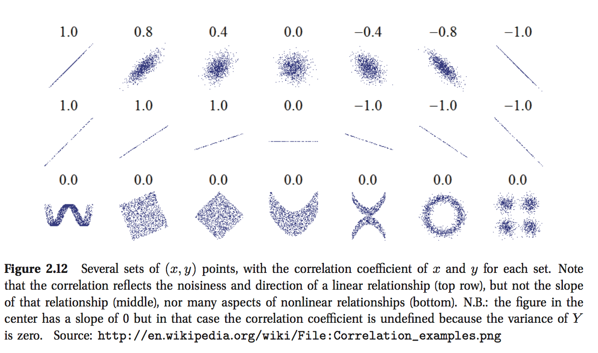

<style>
p.caption {
  font-size: 0.78em;
}
</style>


```{r setup, include=FALSE}
knitr::opts_chunk$set(echo = TRUE)
```


<br />


# 1. Introducción

Continuando con la clase pasada, es importante considerar que el análisis exploratorio para encontrar anomalías va relacionado con el problema a resolver (por ejemplo, clasificación o predicción numérica). Como ya vimos, hay diversas técnicas de visualización y transformaciones con las cuales podemos apoyarnos para encontrar los supuestos que nuestros modelos requieren, así como para acelerar la convergencia.

Hemos estado hablando de anomalías en ciertas observaciones, pero qué sucede con las anomalías de las variables? En esta ocasión, veremos una estrategia que nos ayuda a representar nuestros datos desde otra perspectiva: Análisis de Componentes Principales.  Para lo cual estaremos usando la normalización (en particular, estandarización centrando y escalando los datos) y haremos referencia a las anomalías en el conjunto total de los datos.


Este algoritmo nos ayuda con un problema frecuente: Un exceso de características/variables a evaluar en comparación con el tamaño de muestra - High dimensionality.


<br />

# 2 Análisis de Componentes Principales - Principal Component Analysis PCA

Muchos problemas a resolver en el área de Ciencia de Datos tienen conflictos de dimensiones, ya que es frecuente tener una gran cantidad de información para pocos elementos de muestra. Al contrario de la clase anterior, ahora estamos trabajando con aspectos de las columnas (variables o predictors).

Para resolver este conflicto se puede realizar una reducción de dimensiones (mantener únicamente cierta cantidad de variables). Dicha estrategia puede realizarse con distintas medidas y modelos, normalmente enfocados en que las variables que se mantengan sean aquellas que tienen un mejor potencial para cumplir con el objetivo de los modelos, por ejemplo, una predicción o una clasificación. Ademas, nos ayuda a eliminar variables altamente correlacionadas.

La estrategia de Análisis de Componentes Principales (Principal component analysis, PCA) tiene como objetivo mantener aquellas variables con la mayor variación posible. Si consideramos que cada elemento de la muestra con dimensión m contiene todas estas variables en distintas direcciones, entonces veremos que PCA se encarga de representar n combinaciones lineales de las m variables originales para encontrar patrones en la muestra $(n<m)$ y poder identificar variables correlacionadas.

Para entender mejor PCA es necesario hacer referencia a las siguientes nociones de álgebra y geometría. Con base en esta perspectiva, la intención principal es encontrar direcciones donde la matriz de covarianza, sea prácticamente una matriz diagonal (ceros fuera de la diagonal).

- Matriz de correlaciones y covarianza
- Eigenvectores y eigenvalores (valores de la matriz de covarianza - diagonal - y sus direcciones)
- Proyecciones ortogonales (a un espacio de menos dimensiones)


```{r, out.width = "700px", echo=FALSE, fig.align = "center"}

```

_Source: correlations - Machine Learning, A Probabilistic Perspective _

<br />

"Classical PCA statement of the theorem (Machine Learning, A Probabilistic Perspective (Kevin P. Murphy) (MIT Press) 2012): First principal component or principal direction is the best 1-dimensional approximation to the data". En las siguientes ayudantias verán mas detalles al respecto de las condiciones necesarias y algunos ejemplos con matrices sencillas[^1]. Mientras tanto, la interpretación y el desarrollo en el lenguaje R nos ayudaran a comprender mejor el uso y contexto.

<br /> 

La primera parte del código corresponde a leer, describir y filtrar el dataframe. Estaremos usando los mismo datos de compañías en Mexico. 


``` {r echo=FALSE,results = 'hide'}
##### Read the files 
globalCompanies <- read.csv("outliers_data/globalCompanies_sandp.csv")

##### Take a look to the size and columns
nrow(globalCompanies)
colnames(globalCompanies)

##### Take a look to the first row
head(globalCompanies,3)

##### Summary
sapply(globalCompanies,class)
table(sapply(globalCompanies,class))
summary(globalCompanies$Country)

##### Filter
suppressMessages(library(dplyr))
mexComp <- filter(globalCompanies, Country=="Mexico")
##### No rows with missings
mexComp <- mexComp[complete.cases(mexComp), ]
nrow(mexComp)


### Capitaliazacion de mercado 
mexComp$marketCap <- mexComp$currentPrice * mexComp$sharesOutstanding
### Apalancamiento o Leverage : Borrowed money (debt) to generate returns on investments
### Debt-to-EBITDA Ratio
mexComp$leverageEbitda <- mexComp$totalDebt / mexComp$ebitda


##################################### Log variables #################################
mexComp$log_fullTimeEmployee <- log(mexComp$fullTimeEmployee)
mexComp$log_currentPrice <- log(mexComp$currentPrice)
mexComp$log_totalDebt <- log(mexComp$totalDebt)
mexComp$log_totalRevenue <- log(mexComp$totalRevenue)
mexComp$log_sharesOutstanding <- log(mexComp$sharesOutstanding)
mexComp$log_marketCap <- log(mexComp$marketCap)
mexComp$log_leverageEbitda <- log(mexComp$leverageEbitda)
########################################################################################
```

``` {r}
################################# Pairs of numeric variables#####################
varMexComp <- c('fullTimeEmployee','currentPrice','totalRevenue','totalDebt','sharesOutstanding','marketCap','leverageEbitda')
mexCompNumeric <- mexComp[varMexComp]

log_varMexComp <- c('log_fullTimeEmployee','log_currentPrice','log_totalRevenue','log_totalDebt','log_sharesOutstanding','log_marketCap','log_leverageEbitda')
mexCompLogNumeric <- mexComp[log_varMexComp]
###################################################################################

```


```{r echo=FALSE,results = 'hide'}
######### plot 2 numerics and 1 categoric
sectorSelected <- 'Industrials'

#plot(mexComp$log_totalRevenue, mexComp$log_totalMarketCap,  type="n" ,xlab='LogTotalRevenue', ylab='LogMarketCap')
#points(mexComp$log_totalRevenue[mexComp$Sector==sectorSelected], mexComp$log_totalMarketCap[mexComp$Sector==sectorSelected], pch=1,col='#EE6A50')
#points(mexComp$log_totalRevenue[mexComp$Sector!=sectorSelected], mexComp$log_totalMarketCap[mexComp$Sector!=sectorSelected], pch=1,col='#00008B')

changeSectorDumm <- function(x) { if(x==sectorSelected){ return (1) } else {return (0)} }
mexComp$SectorDumm <- sapply(mexComp$Sector, changeSectorDumm )


```


Como vamos a ver en el siguiente ejemplo, existen dos direcciones/componentes ortogonales y no correlacionados, donde se encuentra la mayor variacion de la muestra. De manera consecutiva se usan el resto de las variables para obtener mas componentes principales (direcciones) y finalmente calcular el porcentaje de variacion total que se puede explicar en el modelo (los componentes donde hay una mayor cantidad de información relevante sobre la muestra). PCA nos ayuda a encontrar direcciones opuestas de la variacion, aunque no necesariamente la mejor manera de clasificar. En este caso explicaremos paso a paso el proceso usando paquetería R y posteriormente el desarrollo con matrices, todo con ayuda de una muestra chica para que sea mas fácil la observación y queden claros los conceptos. Dejaremos para próximos análisis la bases de datos mas grandes.


```{r}
######### Select all variables
mexCompSelected <- mexComp[c(log_varMexComp)]
mexCompSelected <- mexCompSelected[is.finite(rowSums( mexCompSelected )),]
df <- head(mexCompSelected,122)  ## leave 2 rows for prediction
nrow(df )

summary(df)

plot(df)

######## Package 
suppressMessages(library(stats))
df.pca <- prcomp(df, center = TRUE, scale. = TRUE)
plot(df.pca, type = "l")
summary(df.pca)
predict(df.pca,newdata=tail(mexCompSelected, 2))

######## Plot
biplot(df.pca)

```


<br /> 

Ahora veamos el proceso con las matrices:

``` {r results='asis'}
library(knitr)

######## Algorithm: Normalization
df.norm <- scale(df, center = TRUE, scale = TRUE)

knitr::kable(head(df.norm), format = "markdown")

knitr::kable(summary(df.norm), format = "markdown")

pairs(df.norm)

### Correlation and covariance
### Source: Machine Learning, A Probabilistic Perspective (Kevin P. Murphy) (MIT Press) 2012
### Covariance: Measures the degree to which X and Y are (linearly) related.
### Correlation: Normalized measure of Covariance that provides strength of relation (covariance but scaled)


```

``` {r results='asis'}
res.covar <- cov(df)
knitr::kable(round(res.covar, 4), format = "markdown")
```

``` {r results='asis'}
stdDev <- apply(df,2,sd)
knitr::kable(round(stdDev, 4), format = "markdown")
```

``` {r results='asis'}
res.correl <- cor(df)
knitr::kable(round(res.correl, 4), format = "markdown")
```


``` {r results='asis'}
res.selected <- res.correl

### Visualization
### Libraries: ggplot2 or d3heatmap or heatmaply 
### Correlation: When x is frequent, it would also be more likely that y happens
suppressMessages(library(reshape2))
melCorrel <- melt(res.correl)
suppressMessages(library(ggplot2))

ggplot(data = melCorrel, aes(Var2, Var1, fill = value))+
  geom_tile(color = "white")+
  scale_fill_gradient2(low = "blue", high = "red", mid = "white", 
                       midpoint = 0, limit = c(-1,1), space = "Lab", 
                       name="Pearson\nCorrelation") +
  theme_minimal()+ 
  theme(axis.text.x = element_text(angle = 45, vjust = 1, 
                                   size = 12, hjust = 1))+
  coord_fixed()


### Eigeinvectors and adjustment
res.eig <- eigen(res.selected)
eigenvalues <- res.eig$values
eigenvectors <- res.eig$vectors
df.adjusted <- t(eigenvectors) %*% t(df.norm)

### Components
df.adjusted <- t(df.adjusted )
colnames(df.adjusted) <- c("comp1", "comp2", "comp3", "comp4","comp5","comp6","comp7")
kable(head(df.adjusted ), format = "markdown")

### Covariance
kable(round(cov(df.adjusted), 4), format = "markdown")
```

```{r}
### Variance per component
stdDev <- apply(df.adjusted,2,sd)
compVar <- stdDev^2
round(compVar , 4)

### Proportion of variance for total variance
propVar <- compVar/sum(compVar)
propVar[0:3]

plot (propVar, xlab="Components", ylab="Proportion",type="b")
plot (cumsum(propVar), xlab="Components", ylab="Cumulative Proportion",type="b")


```

<br />

**Algunos aspectos importantes**:

- La matriz de correlaciones es un buen parametro para saber la cantidad de componentes requeridos. Cuando se tiene una matriz de correlaciones débiles, es probable que se necesiten muchos componentes para capturar la máxima variabilidad posible. Cuando, por el contrario, las correlaciones son altas entonces PCA se encargara de reducir dimensionalidad y se esperara tener una menor cantidad de componentes. 

- Cuando las desviaciones estándar de las variables son similares, conviene el uso de la matriz de covarianzas sobre los datos estandarizados, ya que de este modo se espera que no haya varianzas dominando en los componentes.

- Existen muchas reglas para seleccionar la cantidad de componentes a usar una vez hecha la reducción, pero normalmente se busca llegar a tener un 75 a 90 % de variacion total, o al menos superar la varianza media. El resto de los componentes estarán conformados por el ruido.

``` {r}
mean(eigenvalues)
``` 
``` {r}
propVar[0:3]
``` 


<br />

**Interpretación de los componentes**:

<br />
- Este tema no resulta trivial debido a que por cada componente tenemos una evaluación de todas variables (también conocida como "loadings" que corresponde a la magnitud y dirección: positiva o negativa). Si revisamos la matriz de vectores entonces podemos analizar cuales son las variables con efectos mas fuertes por componente. En este caso solo usaremos 2 componentes para ejemplificar:

``` {r}
log_varMexComp
compSelected <- eigen(res.selected)$vectors[,1:2]
compSelected
plot(compSelected)
```

<br />

- Una alternativa consiste en calcular la correlación entre la matriz y las variables. Veamos el primer componente:

``` {r}
sqrt(eigenvalues[1]) * t(eigenvectors[,1]) %*% solve(sqrt(diag(diag(res.selected))))
```

- Cuando tenemos una gran cantidad de variables por analizar, se vuelve conveniente realizar funciones que de manera automática puedan extraer las variables y sus medidas para cada componente (donde sean relevantes).


<br />


# 3. Visualización espacial de los datos
<br />

Una alternativa mas para evaluar los datos es a nivel gráfico, no solamente para saber acerca de su varianza o diferencias por categoría. Cuando se tienen datos de ubicación, resulta muy interesante saber construir mapas que puedan representar dichos datos a nivel Entidad, Pais, entre otros.. Queremos que conozcan todas estas herramientas con el fin de que logren entender el uso de las librerías y transformaciones necesarias para el análisis de datos.

Una aplicación de esto en el Mercado de Capitales es clara si pensamos en los diferentes instrumentos financieros que corresponden a empresas con mucha diversidad, no solo en productos y servicios, también en la tecnología que usan. En el siguiente mapa podemos ver las empresas de tecnología que existen en Mexico, con base en su entidad federativa, donde es claro que para la creación de modelos que utilicen esta variable será necesario tomar en cuenta la concentración en ciertas entidades.

Para unir estos datos utilizamos como llave los nombres de los Estados que aparecen en la base total de empresas en Mexico de Inegi "RENIECYT-2017" y buscamos latitudes y longitudes. 


```{r}
##################### 
suppressMessages(library(ggplot2))
suppressMessages(library(plotly))
suppressMessages(library(rworldmap))
suppressMessages(library(leaflet))
suppressMessages(library(data.table))
suppressMessages(library(dplyr))
#################### CANTIDAD DE EMPRESAS DE CIENCIA Y TECNOLOGIA POR ESTADO

my_cyt <- fread("outliers_data/RENIECYT-2017-CLEAN.csv")
my_cyt <- my_cyt %>% group_by(Entidad_raw, Longitud, Latitud) %>% summarise(sumEmpresa = sum(Empresa))

magnitude <- my_cyt$sumEmpresa 
cyt_normalized <- (magnitude-min(magnitude))/(max(magnitude)-min(magnitude))
bins <- c(.1, .2, .3, .5, .6, .7,.8,.9, Inf)

pal <- colorBin("PiYG", domain = cyt_normalized, bins = bins)
mapresult <- leaflet(my_cyt) %>% addTiles() %>%
  addCircles(lng = ~Longitud, lat = ~Latitud, weight = 10, radius = ~50*sumEmpresa, 
             popup =  ~paste(paste("Entidad=",Entidad_raw),paste("   ||    numEmpresas",sumEmpresa)),
             color = ~pal(cyt_normalized)
  )

mapresult


```


[^1]: El análisis que veremos sera el concepto clásico, para hablar de un concepto probabilistico se usa “espacios latentes” (Latent space)


