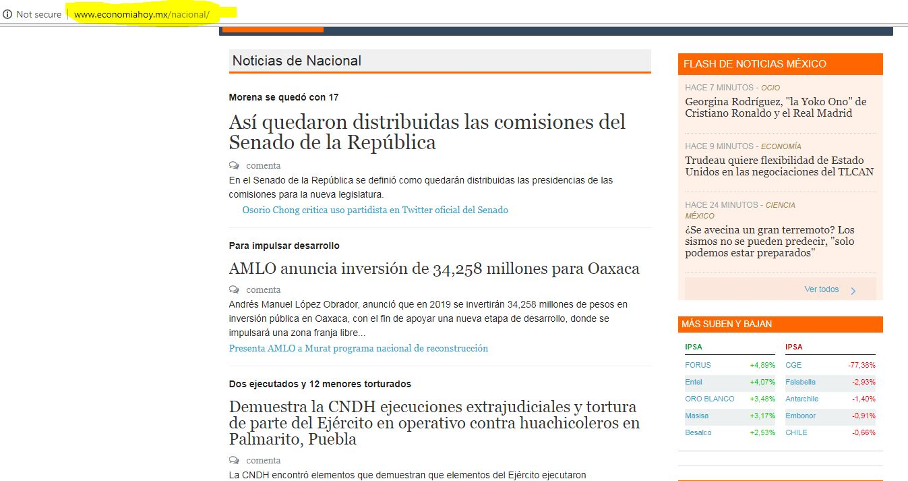
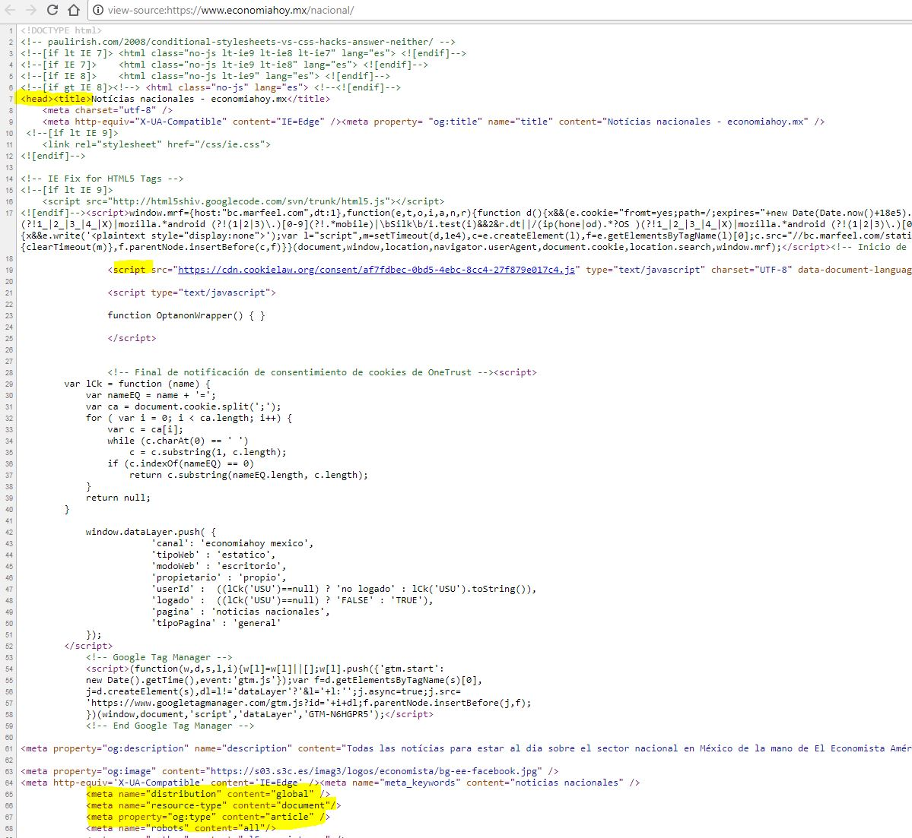
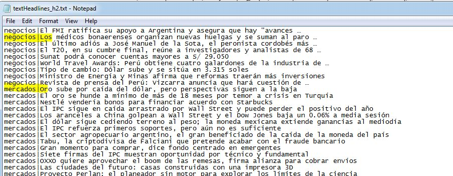
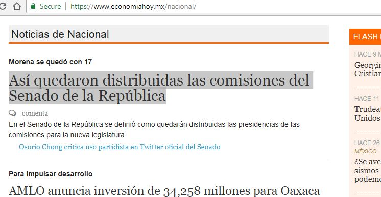
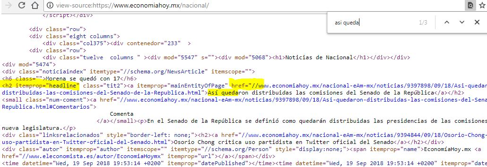

<style>
p.caption {
  font-size: 0.78em;
}
</style>


```{r setup, include=FALSE}
knitr::opts_chunk$set(echo = TRUE)
```


<br />

# Introduccion 

Como les hemos estado hablando en clase acerca de la importancia de las tendencias y noticias en los mercados financieros, el día de hoy vamos a conocer una herramienta de Ciencia de Datos que nos ayuda a extraer esta información, en particular de la Web. En las primeras clases mostramos un ejemplo ilustrativo para obtener precios de Yahoo usando código [Python y la librería BeautifulSoup](https://nbviewer.jupyter.org/github/UNAMCiencias-Seminario-CienciaDeDatos/Seminario_Ciencias/blob/master/RNotebooks/03_Notebook_DatosMdoCapitales/03_Notebook_DatosMercadoCapitales.html) (que se abrevia como bs regularmente) con el fin de mostrar distintas formas de almacenamiento de datos (en la web, en bases de datos, entre otros). En esta ocasión vamos a trabajar con mas detalle en R y la librería rvest[^1], para hablar de las técnicas generales y limitantes que se presentan durante la extracción de datos.

<br />
**Web crawling** (a.k.a. Scraping) es el nombre que se da al proceso de extraer información de Internet y para hablar de ello hay que saber *leer* al menos otros 2 distintos lenguajes de programación que comentamos también al inicio del curso como parte del [formato RMarkdown](https://github.com/UNAMCiencias-Seminario-CienciaDeDatos/Seminario_Ciencias/blob/master/RNotebooks/01_Notebook_IntroRStudio/1_Notebook_IntroductionToRstudio.pdf) (**HTML** para presentar una interfaz y **XML** como un lenguaje de marcas). Con base en estos lenguajes vamos a poder también definir el tipo de información que puede obtenerse (estructurada o no estructurada).

<br />
Para trabajar con esta técnica se debe recordar que no existe un procedimiento especifico, de hecho, una buena parte del reto de extraer datos de Internet corresponde a investigar de que manera esta construida la pagina de donde estamos queriendo conseguir la información. 

<br />
- Algunas tienen ["etiquetas estructuradas" (HTML)](https://web.stanford.edu/group/csp/cs21/htmlcheatsheet.pdf) que nos permiten identificar lo que queremos fácilmente (e.g. h1, h2, h3  = headlines), o una documentación especifica de los datos que buscamos (metadata). En esta clase vamos a dar un ejemplo de esta técnica.

<br />
- En otros casos las paginas permiten el acceso a la información a traes de [formatos como JSON](https://nbviewer.jupyter.org/github/UNAMCiencias-Seminario-CienciaDeDatos/Seminario_Ciencias/blob/master/RNotebooks/02_Notebook_DatosYLenguajes/2_Notebook_DatosYLenguajes.html) para estructurar la información (similar a los diccionarios de Python o las listas en R). Aquí encontraran un [ejemplo usando Python](http://nbviewer.jupyter.org/github/mariazm/website_resources/blob/master/JSON_formats_scrapping_ElasticSearch.ipynb)

<br />
- Otra alternativa es encontrar paginas que permiten el acceso a su información a través de un API (application programming interface), como el que usamos en la tarea para obtener [datos financieros](https://www.quandl.com/tools/api) de la pagina de [Quandl](https://www.quandl.com/).


<br />

# Scraping News: Web & HTML

<br />
Para hablar mas sobre la técnica usando las "etiquetas" (HTML) vamos a usar una pagina de noticias[^2] (**URL: https://www.economiahoy.mx/**) que tiene distintas secciones (tabs): "negocios","mercados","nacional","opinion",entre otros.

<br />
```{r, out.width = "900px", echo=FALSE, fig.align = "center"}
knitr::include_graphics("images/web1.jpg")
```


<br />

Cuando vamos a uno de los tabs (**Nacional** por ejemplo), podemos ver que presentar una serie de noticias de la siguiente forma: Encabezados (headline) y descripción (text / content). Es **muy IMPORTANTE** ver la dirección URL que nos lleva a esta sección (e.g. http://www.economiahoy.mx/nacional/)

<br />
```{r, out.width = "900px", echo=FALSE, fig.align = "center"}

```


<br />

La imagen anterior, podemos encontrarla en la pagina con el **lenguaje HTML** si nos vamos al código fuente (click derecho -> view page source) y se ve de la siguiente manera. Es importante observar los tags como < head >, < title > o < meta > (metadata) ya que esa es precisamente la parte que queremos conocer para mandar llamar con ayuda de la librería de R (o Python). 


<br />
```{r, out.width = "1100px", echo=FALSE, fig.align = "center"}

```


# Scraping News: R package


<br />
Una vez que logramos encontrar lo que queremos, es importante crear una **función en R** que nos ayude a evaluar todas las paginas que tengan el mismo formato. En particular, el interés en este ejercicio es crear un archivo con la lista de secciones y sus respectivas noticias (headlines h2) como en la siguiente imagen.

<br />
```{r, out.width = "1100px", echo=FALSE, fig.align = "center"}

```

<br />
Es decir, vamos a crear un código que haga una iteración sobre cada sección. Empezaremos por declarar las principales variables (globales). Hacemos esto para que vean la diferencia entre las **variables globales** (fuera de la función) y **locales**. 

<br />
```{r}

### Global Var

### local path
location <- 'data/'

### Website prefix, iterations and suffix
tempURL <- 'http://www.economiahoy.mx/'
tempSectionList <- c("negocios","mercados","nacional")
tempPostURL <- '/'   

### This is how it looks like
paste0(tempURL,tempSectionList[1],tempPostURL)

```

<br /> 

Vamos a importar las librerías necesarias y declarar una variable global de la ubicación general de mis archivos. 

```{r}
### Libraries
library(rvest)
library(curl)
```


<br />

La siguiente función va a recibir un total de 6 **variables locales** (para usar en la función):

- **baseURL** con el prefijo de la pagina (URL) y **portURL** con el sufijo de la pagina (URL)
- **keywordHTML** con la "etiqueta" que estamos buscando para encontrar la información (como < head >, < title > o < meta > (metadata))
- **filename** para el nombre final del archivo que vamos a crear con las noticias. En este caso sera un archivo de texto (TXT file) separado por el símbolo "|" (pipeline), ya que no podemos separar por ejemplo con "," comas (CSV) porque las noticias pueden tener comas y podríamos confundir las columnas en nuestro archivo. La idea es poder leer esto después como un dataframe de dos columnas: Sección y Noticia.
- **tempWordsLink** es en este caso es la lista de secciones sobre la que vamos a iterar (e.g. http://www.economiahoy.mx/negocios/)
- **optionHTML** esta variable nos indica que código en R usamos (asi esta hecha la librería de R) para mandar llamar ya sea las "etiquetas" (OPCION 1 de codigo)  o la documentación de la pagina (**metada** OPCION 2 de codigo) 

```{r}
webNews <- function(baseURL, portURL, keywordHTML, filename, tempWordsLink, optionHTML){
  
    ### Local var: baseURL, portURL, keyword, filename
    
    ### Create a list (dictionary) of news 
    newsData <- vector(mode = 'list', length=length(tempWordsLink))
    names(newsData) <- tempWordsLink
    newsData
    
    ### Get the HTML data
    for (i in names(newsData))
    {
      WEBLINK <- paste0(baseURL,i,portURL)
      #print (WEBLINK)
      content <- read_html(curl(WEBLINK, handle = curl::new_handle("useragent" = "Mozilla/5.0")))
      
      ### Option 1
      if (optionHTML==1) {
        most_read <- content  %>% html_nodes(xpath = keywordHTML) %>%  html_attr('content')
      }
      ### Option 2
      if (optionHTML==2) {
        most_read <- content  %>% html_nodes(keywordHTML) %>% html_text()
      }
      
      newsData[[i]][[1]] <- most_read
      
      #date_time<-Sys.time()
      #while((as.numeric(Sys.time()) - as.numeric(date_time))<10){}
    }
    
    #newsData
    
    ### Transform into dataframe and put it into a txt file
    fn <- paste0(location, filename,'.txt')
    if (file.exists(fn)) file.remove(fn)   #make sure the file is deleted first
    for (stock in names(newsData))
    {
      for (headline in newsData[[stock]][[1]]) {
        #### Remove pipelines, breaklines, quotes"" and tabs from the text
        headline <- sub("|", "", headline, fixed = TRUE)
        headline <- sub("\n", "", headline, fixed = TRUE)
        headline <- gsub("[\r\n\"]", "", headline)
        row <- data.frame(stock, headline)
        write.table(row, file = paste0(location,filename,'.txt'), sep = "|", append = TRUE, quote = FALSE, col.names = FALSE, row.names = FALSE)
        
      }
    }
    
    return (newsData)

}
```


<br />

En la funcion anterior veran que dejamos **comentado el codigo date_time<-Sys.time() y un while-loop**. Lo hicimos porque algunas veces las paginas de internet (para evitar que se haga mal uso de sus paginas) ponen restriccion en la frecuencia con la que las mandamos llamar desde nuestra computadora (IP address and Proxy Services). Si tienen problema con esto seria conveniente agregar esas dos lineas en la funcion y tratar con distintos intervalos de pausa (en este codigo son 10 segundos). Para mas tips ["How to prevent getting blacklisted while scraping"](https://www.scrapehero.com/how-to-prevent-getting-blacklisted-while-scraping/). 


<br />

En este ejemplo usaremos como **_keywordHTML_** la **etiqueta "h2"** porque **buscando el texto** que queríamos **en el codigo fuente** (por ejemplo, buscando uno de los encabezados que dicen "Asi quedaron..") nos encontramos con que, en esta pagina, la etiqueta "h2" tiene **únicamente** los encabezados de **esas noticias que estamos buscando**, por lo tanto es la forma mas directa y fácil de acceder a ellos [^3].


<br />
```{r, out.width = "1100px", echo=FALSE, fig.align = "center"}

```


<br />
```{r, out.width = "1100px", echo=FALSE, fig.align = "center"}

```


<br />

Ahora hagamos uso de esta funcion para encontrar los encabezados y vamos a imprimir el primer set de resultados de la lista, que corresponde a una de las secciones.


```{r}

searchWord <- 'h2'
fileNew <- "textHeadlines_h2"
metaHTML <- 2

newsResult <- webNews(tempURL, tempPostURL, searchWord, fileNew, tempSectionList, metaHTML)

newsResult[1]

```


<br />

Sin tener que volver a escribir todos los pasos, vamos a usar la misma funcion para obtener metada. Es decir, la etiqueta a buscar es **"meta_keywords"** la cual esta _a su vez dentro_ de la etiqueta **"meta"** (cuyo contenido es la documentación creada por los desarrolladores de la pagina, es un tipo de "glosario"). Es importante ver que cambiamos también el valor de la variable **metaHTML** porque ahora necesitamos otra linea de codigo en R. Como esta es la única linea que cambia en toda la funcion, se pueden hacer este tipo de variables **(a.k.a. Flag)** para indicar en que casos queremos usar una linea o no -> if (optionHTML==1) { ...}


```{r}

searchWord <- '//meta[@name="meta_keywords"]'
fileNew <- "textMeta_keywords"
metaHTML <- 1

newsResult <- webNews(tempURL, tempPostURL, searchWord, fileNew, tempSectionList, metaHTML)

newsResult

```

<br />

El resultado aquí fue una sola linea por sección ya que en la pagina por cada sección hay únicamente una linea de información cuya etiqueta es "meta_keywords"


# Referencias

[^1]: [packages rvest](https://cran.r-project.org/web/packages/rvest/rvest.pdf)
[^2]: Otros recursos para noticias: 'https://seekingalpha.com', 'https://quotes.wsj.com', 'https://www.reuters.com/finance/stocks/company-news/', 'https://www.nasdaq.com/'
[^3]: TIP PARA NO OLVIDAR: Esta es una muy buena forma para obtener también los links (URL) que nos pueden llevar a obtener el contenido completo de las noticias (incluso imágenes). Estaríamos entonces interesado en usar la etiqueta < href > que esta dentro de estos encabezados < h2 >
